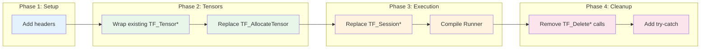
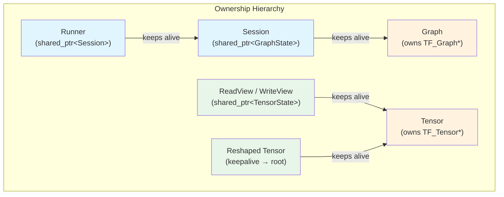
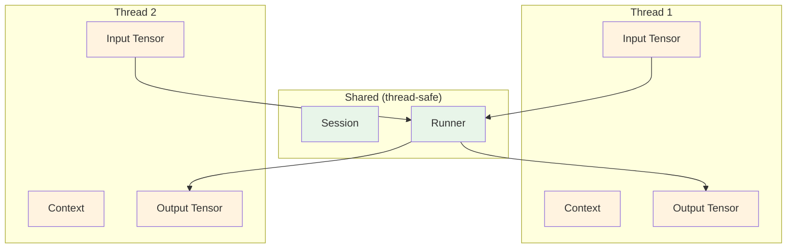

# Migration Guide - TensorFlow C API to TensorFlowWrap

## Scope

This guide covers migrating production inference code from the raw TensorFlow C API to TensorFlowWrap, a minimal C++20 wrapper that adds RAII ownership, structured errors, and a compiled execution model.

The wrapper has no external dependencies beyond TensorFlow itself. It exists to prevent the memory safety bugs and silent failures that plague raw C API usage in production.

## Not covered

- Training workloads (inference only)
- Graph construction (use SavedModel export)
- Custom op development (use raw C API)
- Other runtimes (TF Lite, ONNX, etc.)

## Prerequisites

- Working knowledge of the TensorFlow C API
- Familiarity with C++ RAII and move semantics

## Migration Guide Card

**From:** TensorFlow C API (`TF_NewTensor`, `TF_SessionRun`, manual `TF_Delete*` calls)
**To:** TensorFlowWrap (`tf_wrap::Tensor`, `tf_wrap::Session`, `tf_wrap::Runner`)
**Why migrate:** Eliminate use-after-free bugs, double-free crashes, leaked tensors, and unchecked TF_Status errors that cause silent failures in production
**Compatibility strategy:** Incremental replacement with zero-copy interop; `BorrowedTensor` allows mixing wrapped and raw tensors during transition
**Mechanical steps:**
1. Replace `TF_Tensor*` with `tf_wrap::Tensor`
2. Replace `TF_Session*` with `tf_wrap::Session`
3. Replace `TF_SessionRun` loops with compiled `Runner`
4. Remove all manual `TF_Delete*` calls
5. Replace `TF_Status*` checks with structured error handling

**Behavioral equivalence:** Identical inference results; identical TF_SessionRun semantics
**Intentional differences:** Errors throw exceptions (configurable); names resolved once at startup
**Failure model:** C return codes → C++ exceptions with structured `tf_wrap::Error` containing TF_Code, context, and source_location
**Threading model:** Unchanged — `Session::Run()` remains thread-safe per TensorFlow's guarantee; individual tensors are single-threaded (one per request)
**Lifetime model:** RAII ownership; views keep underlying data alive via `shared_ptr`; moved-from objects are safe but empty
**Alternatives:** Direct C API (current state), TensorFlow C++ API (unstable ABI, heavy)
**Verification:** Sanitizers (ASan, UBSan), existing integration tests, latency benchmarks before/after
**Rollback plan:** Keep C API code paths behind feature flag during transition; `BorrowedTensor` allows gradual migration

## Alternatives

### Why Not Stay on Raw C API?

The TensorFlow C API transfers all safety responsibility to the caller.

| Failure Mode | C API Behavior | Production Impact |
|--------------|----------------|-------------------|
| Forget `TF_DeleteTensor` | Memory leak | OOM after hours of serving |
| Double `TF_DeleteTensor` | Undefined behavior | Intermittent crashes |
| Use tensor after delete | Use-after-free | Silent corruption or crash |
| Ignore `TF_Status` | Silent failure | Wrong inference results |

TensorFlowWrap eliminates these failure modes structurally through RAII ownership and mandatory status checks.

### Why Not TensorFlow C++ API?

The official TensorFlow C++ API (`tensorflow/cc/`) has fundamental problems for production use: unstable ABI (breaks between minor versions), massive header weight, and inconsistent error handling. It is designed for TensorFlow internal development, not external production inference.

TensorFlowWrap wraps the stable C ABI with minimal headers and consistent error handling.

## Mapping: From → To

### Core Types

| C API | TensorFlowWrap | Notes |
|-------|----------------|-------|
| `TF_Tensor*` | `tf_wrap::Tensor` | RAII ownership; move-only |
| `TF_Session*` | `tf_wrap::Session` | Freezes graph on construction |
| `TF_Graph*` | `tf_wrap::Graph` | Mutable until session created |
| `TF_Status*` | Exceptions | Throws `tf_wrap::Error` |
| `TF_Output` | `TF_Output` (unchanged) | Resolved via `Session::resolve()` |

### Tensor Creation

The C API requires explicit allocation, initialization, and cleanup. TensorFlowWrap provides type-safe factory methods that handle allocation and enforce correct dtype mapping.

**C API (27 lines, 4 failure points):**

```c
// Create a float tensor with shape [2, 3]
int64_t dims[] = {2, 3};
size_t num_bytes = 6 * sizeof(float);

TF_Tensor* tensor = TF_AllocateTensor(TF_FLOAT, dims, 2, num_bytes);
if (!tensor) {
    // Handle allocation failure
    return ERROR_OOM;
}

float* data = (float*)TF_TensorData(tensor);
if (!data) {
    TF_DeleteTensor(tensor);  // Must not forget
    return ERROR_NULL_DATA;
}

// Initialize data
for (int i = 0; i < 6; i++) {
    data[i] = (float)i;
}

// ... use tensor ...

// CRITICAL: Must remember to delete
TF_DeleteTensor(tensor);  // Forgetting this = memory leak
                          // Calling twice = undefined behavior
```

**TensorFlowWrap (3 lines, 0 failure points):**

```cpp
// Create a float tensor with shape [2, 3]
auto tensor = tf_wrap::Tensor::FromVector<float>(
    {2, 3},                           // Shape
    {0.0f, 1.0f, 2.0f, 3.0f, 4.0f, 5.0f}  // Data
);
// Destructor handles cleanup automatically
// Move semantics prevent accidental copies
// Type system prevents dtype mismatches
```

The wrapper version cannot leak memory, cannot double-free, cannot have dtype mismatches, and cannot forget to check allocation success (failure throws).

### Tensor Data Access

Raw pointer access in the C API requires manual lifetime tracking. TensorFlowWrap provides views that keep the underlying tensor alive.

**C API (dangerous):**

```c
float* get_tensor_data(TF_Tensor* t) {
    return (float*)TF_TensorData(t);
}

void process() {
    TF_Tensor* t = create_tensor();
    float* data = get_tensor_data(t);
    TF_DeleteTensor(t);  // Oops
    use_data(data);      // Use-after-free: undefined behavior
}
```

**TensorFlowWrap (safe):**

```cpp
void process() {
    auto tensor = create_tensor();
    auto view = tensor.read<float>();  // View holds shared_ptr to tensor state
    
    // Even if tensor is moved or destroyed, view keeps data alive
    auto tensor2 = std::move(tensor);  // tensor is now empty
    
    use_data(view);  // Safe: view's keepalive prevents deallocation
}  // Data freed here when view destructs
```

The `ReadView` and `WriteView` types hold a `shared_ptr` to the tensor's internal state, preventing the underlying memory from being freed while the view exists.

### Session Creation and Inference

The C API requires manual orchestration of graphs, sessions, inputs, outputs, and status checking. TensorFlowWrap provides a compiled `Runner` that resolves names once at startup.

**C API (typical production pattern, 45+ lines):**

```c
// Setup (error handling omitted for brevity — each call needs status check)
TF_Graph* graph = TF_NewGraph();
TF_Status* status = TF_NewStatus();
TF_SessionOptions* opts = TF_NewSessionOptions();

// Load model
TF_Buffer* graph_def = read_file("model.pb");
TF_ImportGraphDefOptions* import_opts = TF_NewImportGraphDefOptions();
TF_GraphImportGraphDef(graph, graph_def, import_opts, status);
// Must check status here

TF_Session* session = TF_NewSession(graph, opts, status);
// Must check status here

// Resolve operations (done on EVERY inference call in naive code)
TF_Operation* input_op = TF_GraphOperationByName(graph, "input");
TF_Operation* output_op = TF_GraphOperationByName(graph, "output");

// Inference loop
while (running) {
    TF_Tensor* input_tensor = create_input();
    
    TF_Output inputs[] = {{input_op, 0}};
    TF_Output outputs[] = {{output_op, 0}};
    TF_Tensor* input_values[] = {input_tensor};
    TF_Tensor* output_values[] = {NULL};
    
    TF_SessionRun(session,
        NULL,
        inputs, input_values, 1,
        outputs, output_values, 1,
        NULL, 0,
        NULL, status);
    
    if (TF_GetCode(status) != TF_OK) {
        // Handle error — but what about output_values[0]?
        // Is it allocated? Must we free it?
    }
    
    process_output(output_values[0]);
    
    TF_DeleteTensor(input_tensor);
    TF_DeleteTensor(output_values[0]);  // Don't forget!
}

// Cleanup (in correct order!)
TF_CloseSession(session, status);
TF_DeleteSession(session, status);
TF_DeleteGraph(graph);
TF_DeleteStatus(status);
// Forgetting any of these = resource leak
```

**TensorFlowWrap (complete, production-ready):**

```cpp
// Setup: load model and compile runner (once at startup)
auto [session, graph] = tf_wrap::Session::LoadSavedModel(
    "model_dir", {"serve"});

auto runner = tf_wrap::RunnerBuilder(std::make_shared<tf_wrap::Session>(std::move(session)))
    .feed("serving_default_input:0")
    .fetch("StatefulPartitionedCall:0")
    .compile();  // Names resolved HERE, not on every call

// Inference loop: zero-allocation hot path
tf_wrap::Runner::Context ctx;  // Reusable buffers

while (running) {
    auto input = create_input();
    
    // Single call, single output, exceptions on failure
    auto output = runner(input);
    
    process_output(output);
}
// All cleanup automatic via destructors
```

The `Runner` resolves operation names to `TF_Output` handles at `compile()` time. The hot path uses only pre-resolved handles, eliminating string lookups. The `Context` object provides reusable buffers for zero-allocation serving loops.

### Error Handling

The C API uses return codes that are routinely ignored. TensorFlowWrap makes errors impossible to ignore.

**C API (common bug):**

```c
TF_SessionRun(session, ..., status);
// Programmer forgot to check status
// TensorFlow failed silently
// output_values[0] contains garbage
float* data = TF_TensorData(output_values[0]);  // Crash or corruption
```

**TensorFlowWrap (errors cannot be ignored):**

```cpp
try {
    auto output = runner(input);
    // If we reach here, inference succeeded
} catch (const tf_wrap::Error& e) {
    // Structured error with:
    // - e.code()      : TF_Code (TF_INVALID_ARGUMENT, TF_RESOURCE_EXHAUSTED, etc.)
    // - e.context()   : "Runner::operator()"
    // - e.op_name()   : "serving_default_input"
    // - e.index()     : 0
    // - e.location()  : source_location where error occurred
    log_error(e.what());
}
```

The `tf_wrap::Error` class preserves all diagnostic information from TensorFlow while adding C++ source location tracking for debugging.

## Step-by-step migration plan



### Phase 1: Add TensorFlowWrap to build

Add the header-only library to your include path. No link-time dependencies beyond what you already have for TensorFlow.

```cmake
target_include_directories(myapp PRIVATE path/to/tensorflowwrap/include)
```

Verify compilation:

```cpp
#include "tf_wrap/core.hpp"  // Single include for all components

void test_import() {
    tf_wrap::Tensor t;  // Should compile
}
```

### Phase 2: Wrap existing tensors

Use `Tensor::FromRaw()` to wrap existing `TF_Tensor*` without copying. This allows gradual migration while maintaining existing allocation patterns.

```cpp
// Existing code creates raw tensor
TF_Tensor* raw = TF_AllocateTensor(...);
initialize_tensor(raw);

// Wrap it (takes ownership)
tf_wrap::Tensor wrapped = tf_wrap::Tensor::FromRaw(raw);
// Do NOT call TF_DeleteTensor(raw) — wrapped owns it now

// Or, for interop without ownership transfer:
tf_wrap::Runner::BorrowedTensor borrowed{raw, nullptr};
auto output = runner(borrowed);
```

### Phase 3: Replace tensor creation

Replace `TF_AllocateTensor` + manual initialization with factory methods:

```cpp
// Before
TF_Tensor* t = TF_AllocateTensor(TF_FLOAT, dims, ndims, nbytes);
float* p = (float*)TF_TensorData(t);
memcpy(p, src, nbytes);

// After
auto t = tf_wrap::Tensor::FromVector<float>(shape, data);
// Or for zero-copy from existing buffer:
auto t = tf_wrap::Tensor::FromBuffer<float>(shape, span);
```

### Phase 4: Replace session creation

Replace `TF_NewSession` + manual graph loading with `Session::LoadSavedModel` or `Session` constructor:

```cpp
// Before
TF_Graph* g = TF_NewGraph();
TF_ImportGraphDefOptions* opts = TF_NewImportGraphDefOptions();
TF_GraphImportGraphDef(g, buffer, opts, status);
TF_Session* s = TF_NewSession(g, session_opts, status);

// After
auto [session, graph] = tf_wrap::Session::LoadSavedModel(
    export_dir, {"serve"});
```

### Phase 5: Compile runners

Replace ad-hoc `TF_SessionRun` calls with compiled runners:

```cpp
// Before (on every call)
TF_Operation* input_op = TF_GraphOperationByName(graph, "input");
TF_Operation* output_op = TF_GraphOperationByName(graph, "output");
TF_Output inputs[] = {{input_op, 0}};
TF_Output outputs[] = {{output_op, 0}};
TF_SessionRun(...);

// After (once at startup)
auto runner = tf_wrap::RunnerBuilder(session_ptr)
    .feed("input:0")
    .fetch("output:0")
    .compile();

// Hot path
auto output = runner(input);  // Names already resolved
```

### Phase 6: Remove manual cleanup

Delete all `TF_Delete*` calls. Verify with ASan that no leaks remain.

```cpp
// Delete these lines:
TF_DeleteTensor(tensor);      // Handled by Tensor destructor
TF_DeleteStatus(status);      // No longer needed (exceptions)
TF_CloseSession(session, s);  // Handled by Session destructor
TF_DeleteSession(session, s); // Handled by Session destructor
TF_DeleteGraph(graph);        // Handled by Graph destructor
```

### Phase 7: Add structured error handling

Replace `TF_GetCode(status) != TF_OK` checks with try-catch:

```cpp
// Before
if (TF_GetCode(status) != TF_OK) {
    log_error(TF_Message(status));
    return -1;
}

// After
try {
    auto output = runner(input);
} catch (const tf_wrap::Error& e) {
    log_error("{}: {} (code={})", e.context(), e.what(), e.code_name());
    return -1;
}
```

## Compatibility and ABI boundaries

TensorFlowWrap wraps the TensorFlow C ABI, which is stable across TensorFlow versions. No recompilation is required when upgrading TensorFlow.

### C ABI Preservation

The wrapper never modifies TensorFlow's C structures. `Tensor::handle()` returns the underlying `TF_Tensor*` for interop with code that requires raw pointers.

```cpp
tf_wrap::Tensor t = ...;

// Interop with legacy code
legacy_function(t.handle());  // Returns TF_Tensor*

// Interop with TF C API directly
TF_DataType dtype = TF_TensorType(t.handle());
```

### Plugin Boundaries

If your inference code crosses plugin/DLL boundaries, pass `TF_Tensor*` at the boundary and wrap/unwrap on each side:

```cpp
// Plugin interface (C ABI)
extern "C" TF_Tensor* plugin_inference(TF_Tensor* input);

// Host side
tf_wrap::Tensor input = ...;
TF_Tensor* raw_output = plugin_inference(input.handle());
tf_wrap::Tensor output = tf_wrap::Tensor::FromRaw(raw_output);
```

## Lifetime and ownership model



### Tensor Ownership

`tf_wrap::Tensor` owns its `TF_Tensor*` exclusively. Move semantics transfer ownership; copying is prohibited.

```cpp
tf_wrap::Tensor a = tf_wrap::Tensor::FromScalar(42.0f);
tf_wrap::Tensor b = std::move(a);  // b now owns the tensor
// a is empty (valid but unusable)
assert(!a.handle());  // a.handle() returns nullptr
```

### View Keepalives

Views (`ReadView`, `WriteView`) hold a `shared_ptr` to the tensor's internal state. The underlying memory remains valid as long as any view exists.

```cpp
tf_wrap::Tensor::ReadView<float> view;
{
    tf_wrap::Tensor t = tf_wrap::Tensor::FromScalar(1.0f);
    view = t.read<float>();
    // t goes out of scope here
}
// view still valid — its shared_ptr keeps the data alive
float value = view[0];  // Safe
```

### Reshape Keepalives

Reshaped tensors are zero-copy views that keep the original data alive:

```cpp
auto original = tf_wrap::Tensor::FromVector<float>({6}, data);
auto reshaped = original.reshape({2, 3});
// reshaped shares data with original
// Either can be destroyed; data lives until both are gone
```

### Session and Graph Lifetime

A `Session` holds a `shared_ptr` to the graph state. The graph is frozen (immutable) once a session is created from it.

```cpp
tf_wrap::Graph graph;
// ... build graph ...

tf_wrap::Session session(graph);
// graph is now frozen — mutations throw

// Session keeps graph alive even if graph object is destroyed
```

### Runner Lifetime

A `Runner` holds a `shared_ptr<const Session>`. The session (and transitively, the graph) remains valid as long as any runner exists.

```cpp
std::shared_ptr<tf_wrap::Session> session = ...;
auto runner = tf_wrap::RunnerBuilder(session)
    .feed("x:0").fetch("y:0").compile();

session.reset();  // Runner still holds a reference
auto output = runner(input);  // Safe
```

## Thread-safety and reentrancy



### Thread Safety Contract

TensorFlowWrap preserves TensorFlow's threading model:

| Operation | Thread Safety |
|-----------|--------------|
| `Session::Run()` | Thread-safe (TensorFlow guarantee) |
| `Runner::operator()` | Thread-safe (calls Session::Run) |
| `Tensor` mutation | NOT thread-safe |
| `Tensor` read | Safe if no concurrent writes |
| `Runner::Context` | NOT thread-safe (one per thread) |

### Production Serving Pattern

For multi-threaded serving, each request should have its own input tensors. Share the session and runner; do not share tensors or contexts across threads.

```cpp
// Shared (thread-safe)
auto session = std::make_shared<tf_wrap::Session>(...);
auto runner = RunnerBuilder(session).feed(...).fetch(...).compile();

// Per-thread (or per-request)
thread_local tf_wrap::Runner::Context ctx;

void handle_request(const Request& req) {
    auto input = create_tensor_from_request(req);  // Thread-local tensor
    auto output = runner.run(ctx, {&input});       // Shared runner, local context
    send_response(output);
}
```

### Reentrancy

TensorFlowWrap operations are not reentrant. Do not call wrapper methods from TensorFlow callbacks or custom op kernels.

## Error and failure model

### C API Error Model

The C API uses `TF_Status*` for error reporting. Errors are easy to ignore:

```c
TF_SessionRun(..., status);
// Easy to forget this check
if (TF_GetCode(status) != TF_OK) { ... }
```

### TensorFlowWrap Error Model

All operations that can fail throw `tf_wrap::Error` on failure. Errors cannot be silently ignored.

```cpp
class Error : public std::runtime_error {
public:
    ErrorSource source() const;     // TensorFlow or Wrapper
    TF_Code code() const;           // TF_INVALID_ARGUMENT, TF_NOT_FOUND, etc.
    const char* code_name() const;  // "INVALID_ARGUMENT", "NOT_FOUND", etc.
    std::string_view context() const;   // "Session::Run", "Tensor::reshape", etc.
    std::string_view op_name() const;   // Operation name if applicable
    int index() const;              // Output index if applicable
    std::source_location location() const;  // File/line where error occurred
};
```

### Error Code Mapping

| TF_Code | Typical Cause | Recommended Action |
|---------|---------------|-------------------|
| `TF_INVALID_ARGUMENT` | Wrong dtype, shape mismatch | Fix input preparation |
| `TF_NOT_FOUND` | Unknown operation name | Check model signature |
| `TF_RESOURCE_EXHAUSTED` | OOM | Reduce batch size |
| `TF_FAILED_PRECONDITION` | Session not initialized | Check initialization order |
| `TF_INTERNAL` | TensorFlow bug | Report to TF team |

### Exception Safety

All TensorFlowWrap operations provide strong exception safety: if an exception is thrown, no resources are leaked and objects remain in valid states.

## Verification plan

Run with AddressSanitizer to verify no memory bugs:

```bash
cmake -DCMAKE_CXX_FLAGS="-fsanitize=address,undefined" ..
make && ./test_inference
```

Compare inference results before and after migration to verify identical outputs.

## Rollback plan

Use a feature flag during migration to maintain both code paths. `BorrowedTensor` allows mixing wrapped and raw tensors for incremental rollback. Complete rollback requires reverting to C API calls and removing TensorFlowWrap includes—no data migration needed since underlying TensorFlow structures are unchanged.

## Key Takeaway Card

| Principle | One-Line Summary |
|-----------|-----------------|
| **RAII Ownership** | Tensors own their memory; destruction is automatic |
| **View Keepalives** | Data views prevent use-after-free via shared_ptr |
| **Compiled Runners** | Resolve names once at startup, not on every call |
| **Structured Errors** | Exceptions with TF_Code, context, and source location |
| **Zero-Copy Interop** | BorrowedTensor enables gradual migration |
| **Thread Safety Preserved** | Session::Run remains thread-safe; tensors are per-request |

## Glossary

**BorrowedTensor**: A wrapper for raw `TF_Tensor*` that allows zero-copy interop between legacy code and TensorFlowWrap runners during migration.

**Context**: Reusable buffers for `Runner` execution that eliminate per-call allocations in serving loops.

**Keepalive**: A `shared_ptr` held by views and reshaped tensors that prevents the underlying data from being freed while references exist.

**Runner**: A compiled inference signature with pre-resolved operation names. Created via `RunnerBuilder` at startup; used for zero-allocation inference in the hot path.

**View**: A `ReadView<T>` or `WriteView<T>` that provides typed access to tensor data while keeping the tensor alive.
