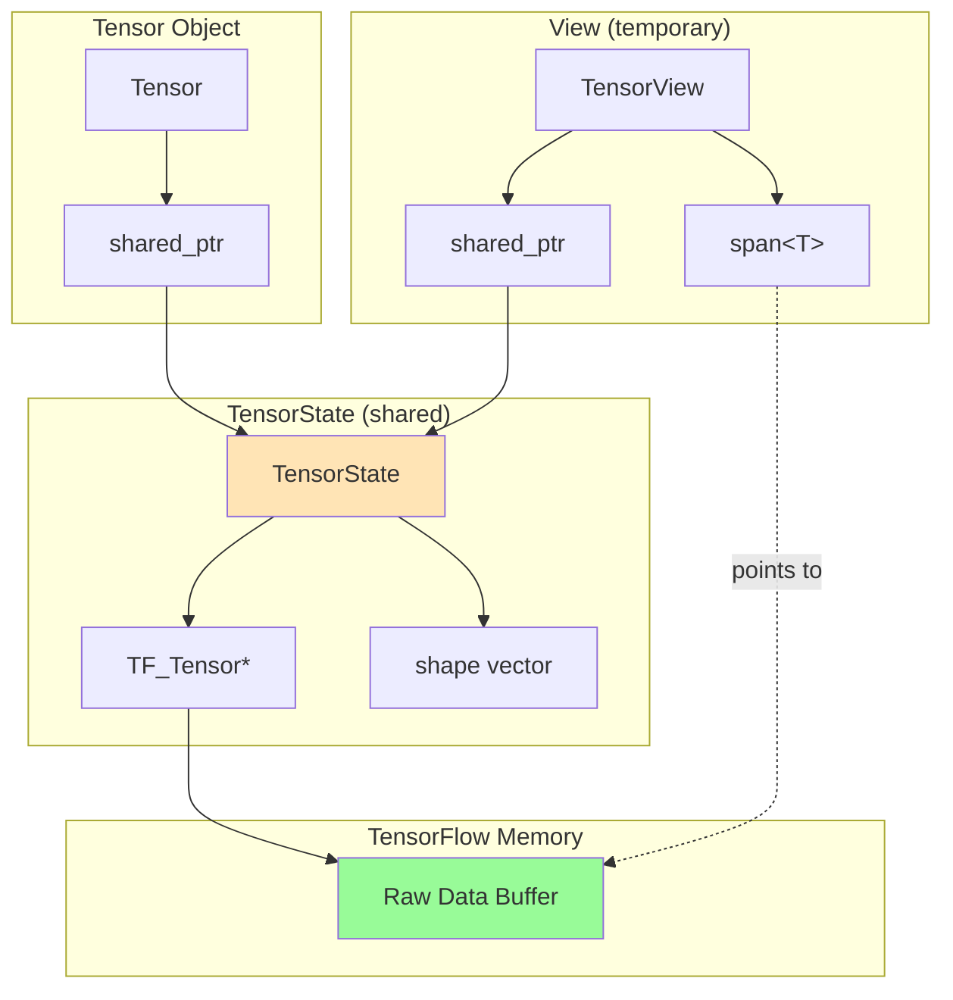
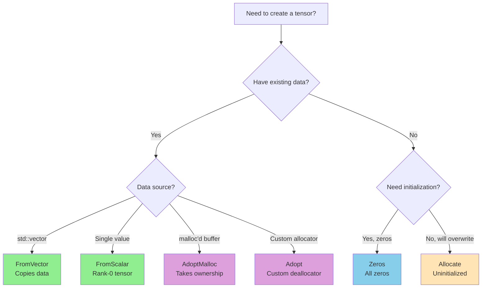
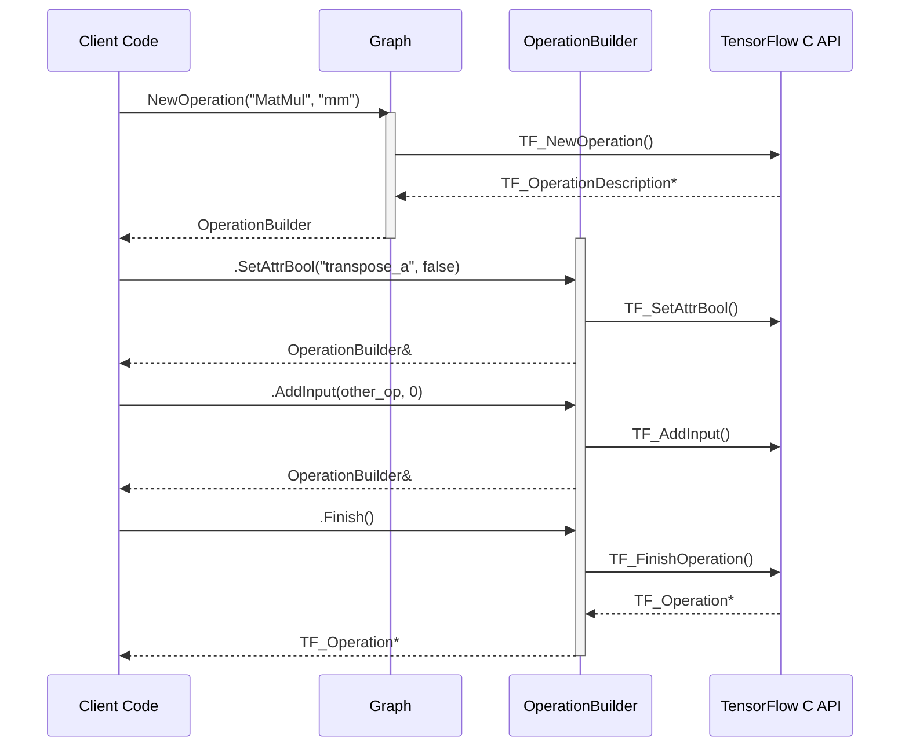
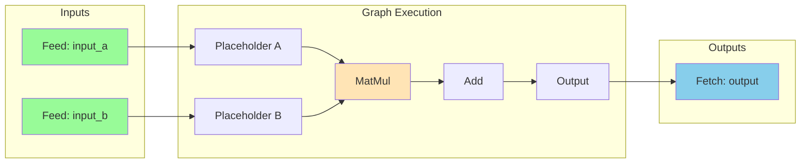

# User Manual - TensorFlow C++20 Wrapper

## Scope

This manual covers correct usage of the TensorFlow C++20 Wrapper library, including tensor creation, data access, graph building, session execution, and error handling. After reading this manual, you will understand how to avoid common lifetime pitfalls and how to integrate the library into production code.

## Not covered

- TensorFlow model training (use Python for training, this library for inference)
- TensorFlow Lite or TensorFlow.js integration
- Performance tuning of TensorFlow itself
- Explicit device placement (device listing is supported, but placement requires raw C API)

## Prerequisites

- C++20 compiler (GCC 11+, Clang 13+, MSVC 2022+)
- TensorFlow C library installed (libtensorflow 2.x)
- Familiarity with RAII and move semantics
- Basic understanding of TensorFlow computational graphs

---

## User Manual Card

**Component:** TensorFlow C++20 Wrapper  
**Primary use case:** Type-safe, RAII-managed TensorFlow inference in C++ applications  
**Integration pattern:** Header-only; include `<tf_wrap/core.hpp>` and link against TensorFlow C library  
**Key API:** `tf_wrap::Tensor`, `tf_wrap::Graph`, `tf_wrap::Session`, `tf_wrap::Status`, `tf_wrap::Device`  
**std equivalent:** None. The TensorFlow C++ API (`tensorflow/cc`) exists but requires building TensorFlow from source  
**Migration from std:** N/A — no standard equivalent  
**Common mistakes:** Holding tensor views across scope boundaries, forgetting to call `Finish()` on operation builders, using wrong dtype template parameter, destroying graph before session  
**Performance notes:** View-based access avoids copies; `HasGPU()` enables runtime hardware detection

---

## Table of Contents

- [The TensorFlow C API Problem](#the-tensorflow-c-api-problem)
- [Architecture: How the Wrapper Works](#architecture-how-the-wrapper-works)
- [Quick Start](#quick-start)
- [Threading](#threading)
- [Tensor Creation: Five Factories, Five Philosophies](#tensor-creation-five-factories-five-philosophies)
- [Tensor Data Access: Views, Callbacks, and Unsafe Pointers](#tensor-data-access-views-callbacks-and-unsafe-pointers)
- [Graph Building: The Operation Builder Pattern](#graph-building-the-operation-builder-pattern)
- [Session Execution: Feeds, Fetches, and Targets](#session-execution-feeds-fetches-and-targets)
- [Loading SavedModels](#loading-savedmodels)
- [Device Enumeration](#device-enumeration)
- [Error Handling Model](#error-handling-model)
- [Performance Rules of Thumb](#performance-rules-of-thumb)
- [When to Use This Library (and When Not To)](#when-to-use-this-library-and-when-not-to)
- [Migration from Raw TensorFlow C API](#migration-from-raw-tensorflow-c-api)
- [Troubleshooting](#troubleshooting)
- [API Reference](#api-reference)
- [FAQ](#faq)
- [Glossary](#glossary)

---

## The TensorFlow C API Problem

### The Hidden Costs of Manual Resource Management

TensorFlow provides a C API for inference that works across languages and platforms. The API is stable, documented, and portable. It is also a minefield of manual resource management.

Consider what happens when you create a tensor in the raw C API. You call `TF_AllocateTensor()`, which returns a `TF_Tensor*`. You are now responsible for calling `TF_DeleteTensor()` exactly once, after all uses complete, but before the program exits. Miss this call and you leak memory. Call it twice and you corrupt the heap. Call it while another thread is reading the tensor data and you have a data race.

The TensorFlow C API requires you to manage at least five distinct resource types, each with its own lifetime rules. `TF_Status` objects must be deleted after checking. `TF_Graph` objects must outlive all sessions using them. `TF_Session` objects must be closed before deletion. Operation descriptions created with `TF_NewOperation()` have no deletion function — abandon one without calling `TF_FinishOperation()` and the graph is corrupted.

This wrapper exists because C++ has a better answer to these problems than careful coding and code review. RAII (Resource Acquisition Is Initialization) ensures that resources are released exactly once, automatically, even when exceptions are thrown or early returns are taken. The wrapper transforms the C API's "remember to delete" contract into C++'s "impossible to forget" guarantee.

### What Goes Wrong Without RAII

The most common failure mode with raw TensorFlow C API code is the leaked status object. Every TensorFlow C function that can fail takes a `TF_Status*` output parameter. The correct pattern looks like this:

```cpp
// Pseudocode showing the C API pattern
TF_Status* status = TF_NewStatus();
TF_SessionRun(session, /*...params...*/, status);
if (TF_GetCode(status) != TF_OK) {
    const char* msg = TF_Message(status);
    TF_DeleteStatus(status);  // Must delete before throwing!
    throw std::runtime_error(msg);
}
TF_DeleteStatus(status);  // Must delete on success path too!
```

The status must be deleted on both the error path and the success path. Miss either deletion point and you leak. The wrapper's `tf_wrap::Status` class eliminates this entire category of bugs — the destructor handles deletion regardless of which path executes.

The second most common failure is the use-after-free tensor access. A function returns a pointer to tensor data, the caller stores the pointer, and later the tensor is deleted while the pointer is still in use. The wrapper's view system prevents this by tying data access to shared ownership — views hold a `shared_ptr` that keeps the data alive, making dangling access impossible rather than a runtime mystery.

---

## Architecture: How the Wrapper Works

### RAII Wrappers for TensorFlow C Types

The wrapper provides RAII classes for TensorFlow's C types. Each wrapper owns its underlying resource and releases it in the destructor:

| Wrapper | Underlying C Type | Cleanup |
|---------|------------------|---------|
| `Tensor` | `TF_Tensor*` | `TF_DeleteTensor()` |
| `Graph` | `TF_Graph*` | `TF_DeleteGraph()` |
| `Session` | `TF_Session*` | `TF_CloseSession()` + `TF_DeleteSession()` |
| `Status` | `TF_Status*` | `TF_DeleteStatus()` |

### Memory Layout and Ownership

Internally, each `Tensor` object owns a `shared_ptr` to a `TensorState` structure containing the raw `TF_Tensor*` and the shape vector. This shared ownership serves a critical safety purpose: it allows tensor views to outlive the tensor object itself.



When you call `tensor.read<float>()`, the returned view captures a shared reference to the tensor's state. Even if the original `Tensor` object goes out of scope while the view is still alive, the underlying data remains valid because the view's shared_ptr keeps the state alive. This design eliminates an entire class of dangling-pointer bugs that plague C API wrappers.

The `Graph` and `Session` wrappers use shared ownership of the underlying `TF_Graph*`.

- `Graph` owns a `shared_ptr` to an internal `GraphState` that deletes the `TF_Graph*` when the last owner goes away.
- `Session` captures (shares) that same `GraphState` when you construct it from a `Graph&`.

This means the `Graph` wrapper object does **not** have to outlive the `Session` wrapper object — the underlying graph stays alive as long as either wrapper still exists.

---

## Quick Start

### Prerequisites and Integration

The wrapper requires C++20 and the TensorFlow C library. Install TensorFlow C and ensure the headers and library are in your compiler's search paths.

Integration is header-only. Include the umbrella header to access all functionality, then link against the TensorFlow C library:

```cpp
#include <tf_wrap/core.hpp>
// Link with: -ltensorflow
```

### Your First Inference

The following complete example creates a computational graph with a single constant, runs it through a session, and prints the result. This pattern — build graph, create session, run inference, extract results — applies to all TensorFlow C++ workflows.

```cpp
#include <tf_wrap/core.hpp>
#include <iostream>

int main() {
    // Create a tensor containing [1.0, 2.0, 3.0, 4.0] with shape [2, 2]
    auto input = tf_wrap::Tensor::FromVector<float>({2, 2}, {1.0f, 2.0f, 3.0f, 4.0f});
    
    // Build a graph with a single Const operation
    tf_wrap::Graph graph;
    auto const_op = graph.NewOperation("Const", "my_constant")
        .SetAttrTensor("value", input.handle())
        .SetAttrType("dtype", TF_FLOAT)
        .Finish();
    
    // Create Identity to make the const fetchable
    graph.NewOperation("Identity", "output")
        .AddInput(const_op, 0)
        .Finish();
    
    // Run the graph
    tf_wrap::Session session(graph);
    auto results = session.Run({}, {tf_wrap::Fetch{"output", 0}});
    
    // Print results
    auto view = results[0].read<float>();
    std::cout << "Result: ";
    for (float x : view) {
        std::cout << x << " ";
    }
    std::cout << "\n";
    
    return 0;
}
```

The example uses `Tensor`, `Graph`, and `Session` — the core wrapper classes. Views keep tensor data alive, preventing dangling pointers even if the tensor object is destroyed while a view exists.

---

## Threading

### TensorFlowWrap Does Not Synchronize

This wrapper is a RAII and type-safety convenience layer. It does not provide thread synchronization.

**Threading contract:**

- `Session::Run()` is thread-safe (this is TensorFlow's guarantee, not the wrapper's)
- Graph is frozen after Session creation (wrapper policy to prevent accidental mutation)
- Tensors are NOT thread-safe — do not share mutable tensors across threads
- Create per-thread input tensors; treat outputs as thread-local

### Recommended Multi-Threaded Pattern

For inference servers handling concurrent requests:

```cpp
// Shared (read-only after creation)
tf_wrap::Graph graph;
// ... build graph ...
tf_wrap::Session session(graph);  // Graph frozen here

// Per-request (each thread creates its own)
void handle_request(const std::vector<float>& input_data) {
    // Thread-local input tensor
    auto input = tf_wrap::Tensor::FromVector<float>({1, 784}, input_data);
    
    // Session::Run is thread-safe
    auto results = session.Run(
        {{"input", input}},
        {{"output", 0}});
    
    // Thread-local output tensor
    auto output = results[0].ToVector<float>();
    // ... use output ...
}
```

Each request handler creates its own input tensors and receives its own output tensors. The only shared object is the Session, which TensorFlow guarantees is safe for concurrent `Run()` calls.

### View Lifetime Safety

While tensors don't provide thread synchronization, views do provide **lifetime safety**. A `TensorView` holds a `shared_ptr` to the tensor's internal state, ensuring the underlying data remains valid even if the original `Tensor` object is destroyed:

```cpp
tf_wrap::Tensor::ReadView<float> get_view() {
    auto tensor = tf_wrap::Tensor::FromVector<float>({3}, {1.0f, 2.0f, 3.0f});
    return tensor.read<float>();  // View keeps data alive
}  // tensor destroyed here, but view's data is still valid

auto view = get_view();
float x = view[0];  // Safe: view holds shared_ptr to data
```

This prevents use-after-free bugs but does NOT provide thread synchronization.

---

## Tensor Creation: Five Factories, Five Philosophies

### Why Five Factory Methods?

The `Tensor` class provides five static factory methods, each serving a distinct use case. Understanding when to use each prevents both bugs and unnecessary copies.



The fundamental question each factory answers differently is: **who owns the memory, and who initializes it?**

### FromVector: Copy-In Creation

`FromVector` creates a tensor by copying data from a vector. TensorFlow allocates the tensor's internal buffer, and the factory copies the vector's contents into that buffer. The source vector can be modified or destroyed immediately after the call returns.

Use `FromVector` when you have data in a vector and want TensorFlow to own its own copy. This is the safest and most common factory for creating tensors from computed results or loaded data:

```cpp
std::vector<float> data = compute_features();
auto tensor = tf_wrap::Tensor::FromVector<float>({batch_size, feature_dim}, data);
// data vector can now be modified or destroyed safely
```

The shape (first argument) and data size must match. A shape of `{2, 3}` requires exactly 6 elements. Mismatches throw `std::invalid_argument` with a message indicating the expected and actual counts.

### FromScalar: Single-Value Tensors

`FromScalar` creates a rank-0 tensor containing a single value. Rank-0 tensors have an empty shape (`[]`) and exactly one element. They are TensorFlow's representation of scalar values.

Use `FromScalar` for scalar constants, learning rates, or single-valued parameters:

```cpp
auto learning_rate = tf_wrap::Tensor::FromScalar<float>(0.001f);
auto batch_size = tf_wrap::Tensor::FromScalar<int32_t>(32);
```

### Allocate: Uninitialized Memory

`Allocate` creates a tensor with uninitialized contents. TensorFlow allocates the buffer, but no initialization occurs. The memory contains whatever values happened to be at those addresses.

Use `Allocate` when you will immediately overwrite all elements, such as output buffers for custom operations. Reading uninitialized memory is undefined behavior, so only use this factory when you can guarantee complete initialization before any read:

```cpp
auto output = tf_wrap::Tensor::Allocate<float>({height, width, channels});
// MUST write all elements before reading any
fill_with_computed_values(output.write<float>());
```

### Zeros: Zero-Initialized Memory

`Zeros` creates a tensor with all elements set to zero (or `false` for boolean tensors). This is equivalent to `Allocate` followed by `memset`, but may be more efficient on some platforms.

Use `Zeros` for accumulators, masks initialized to false, or any case where zero is the correct initial value:

```cpp
auto accumulator = tf_wrap::Tensor::Zeros<float>({embedding_dim});
auto visited = tf_wrap::Tensor::Zeros<bool>({graph_size});
```

### Adopt and AdoptMalloc: External Memory Management

`Adopt` and `AdoptMalloc` create tensors that take ownership of externally allocated memory. These are advanced factories for interoperating with other allocation systems.

`AdoptMalloc` assumes the buffer was allocated with `malloc()` and will be freed with `free()`. Use this when integrating with C libraries or custom allocators that use malloc-compatible allocation:

```cpp
void* buffer = custom_allocator.allocate(num_bytes);
auto tensor = tf_wrap::Tensor::AdoptMalloc<float>({rows, cols}, buffer, num_bytes);
// Tensor now owns buffer; will call free() on destruction
```

`Adopt` takes a custom deallocator function, enabling integration with any memory management scheme. The deallocator receives the pointer, byte count, and an optional context pointer:

```cpp
auto tensor = tf_wrap::Tensor::Adopt(
    TF_FLOAT,
    shape,
    gpu_buffer,
    num_bytes,
    [](void* data, size_t len, void* ctx) {
        cuda_free(data);
    },
    nullptr  // deallocator context
);
```

Both `Adopt` variants validate that the provided byte length matches the expected size for the given shape and dtype. Mismatches throw `std::invalid_argument`, preventing the creation of tensors that would access out-of-bounds memory.

---

## Tensor Data Access: Views, Callbacks, and Direct Pointers

### The View Pattern

Tensor data access uses a view pattern that provides both safety and efficiency. A view is a `std::span` wrapped with a `shared_ptr` to the tensor's internal state, ensuring the data remains valid for the view's lifetime.

The `read<T>()` method returns a read-only view:

```cpp
auto view = tensor.read<float>();
for (float x : view) {
    std::cout << x << " ";
}
// View keeps tensor data alive until it goes out of scope
```

The `write<T>()` method returns a writable view that allows modification of elements:

```cpp
auto view = tensor.write<float>();
for (float& x : view) {
    x *= 2.0f;  // Modify in place
}
```

### Type Safety at Access Time

The template parameter to `read<T>()` and `write<T>()` must match the tensor's actual dtype. A tensor created with `FromVector<float>` must be accessed with `read<float>()`, not `read<int>()`. Mismatches throw `std::invalid_argument` with a message indicating both the expected and actual types:

```cpp
auto tensor = tf_wrap::Tensor::FromVector<float>({4}, {1.0f, 2.0f, 3.0f, 4.0f});
auto view = tensor.read<int>();  // Throws: "dtype mismatch: expected float32, got int32"
```

This runtime check catches type mismatches that static typing cannot. The tensor's dtype is determined at construction from runtime data, but access type is specified at compile time. The check bridges this gap.

### Callback-Based Access

The callback methods `with_read()` and `with_write()` provide an alternative access pattern that makes view scope explicit. The callback receives a `std::span` and can return a value:

```cpp
float sum = tensor.with_read<float>([](std::span<const float> data) {
    return std::accumulate(data.begin(), data.end(), 0.0f);
});
```

This pattern prevents accidentally extending view lifetime. The span cannot escape the callback's scope.

### Direct Pointer Access

The `data<T>()` method returns a raw pointer for integration with external libraries:

```cpp
float* raw = tensor.data<float>();
external_library_process(raw, tensor.num_elements());
```

---

## Graph Building: The Operation Builder Pattern

### The Fluent Builder Interface

Graph operations are constructed using a fluent builder pattern. The builder configures the operation through method chaining, then finalizes it with `Finish()`.



The `NewOperation()` method starts the builder chain. Each attribute setter returns the builder, allowing method chaining. The `Finish()` method completes the operation:

```cpp
auto op = graph.NewOperation("MatMul", "my_matmul")
    .AddInput(a_op, 0)
    .AddInput(b_op, 0)
    .SetAttrBool("transpose_a", false)
    .SetAttrBool("transpose_b", false)
    .Finish();
```

### The Finish Requirement

Every `OperationBuilder` must have `Finish()` called exactly once. The destructor contains a debug assertion that fires if the builder is destroyed without finishing. This catches a common bug: abandoning a partially-configured operation, which corrupts the graph.

The assertion only fires in debug builds. In release builds, the graph may be in an inconsistent state if `Finish()` was not called.

### Input and Control Dependencies

Operations connect through inputs and control dependencies. `AddInput()` connects a data output from one operation to an input of the operation being built. The second parameter is the output index, since operations can have multiple outputs:

```cpp
// Connect output 0 of prev_op to this operation
builder.AddInput(prev_op, 0);

// Connect multiple outputs from the same operation
builder.AddInput(split_op, 0);  // First split output
builder.AddInput(split_op, 1);  // Second split output
```

`AddControlInput()` creates a control dependency without data flow. The operation being built will not execute until the control input has completed, but no data is passed:

```cpp
// Ensure init_op completes before this operation runs
builder.AddControlInput(init_op);
```

### Common Attributes

TensorFlow operations use attributes to configure their behavior. The most common attributes have dedicated setter methods:

| Attribute Type | Method | Example |
|----------------|--------|---------|
| Tensor value | `SetAttrTensor(name, TF_Tensor*)` | Const operation values |
| Data type | `SetAttrType(name, TF_DataType)` | dtype specifications |
| Shape | `SetAttrShape(name, span<int64_t>)` | Output shape hints |
| Integer | `SetAttrInt(name, int64_t)` | Axis indices, sizes |
| Float | `SetAttrFloat(name, float)` | Numeric parameters |
| Boolean | `SetAttrBool(name, bool)` | Flags, modes |
| String | `SetAttrString(name, string_view)` | Padding modes, data formats |

### Operation Lookup

After building operations, you can look them up by name. `GetOperation()` returns `std::optional<tf_wrap::Operation>`, empty if the name is not found. `GetOperationOrThrow()` throws `std::runtime_error` on lookup failure:

```cpp
auto op = graph.GetOperation("my_matmul");
if (op) {
    std::cout << "Found: " << op->name() << "\n";
}

// Or, when you know it must exist:
auto op2 = graph.GetOperationOrThrow("my_matmul");
```

---

## Session Execution: Feeds, Fetches, and Targets

### The Run Method

Session execution uses `Run()` to evaluate graph operations. The method takes three arguments: feeds (input data), fetches (requested outputs), and targets (operations to run without fetching outputs).



Feeds provide input tensors for placeholder operations. Each feed specifies an operation name, output index, and tensor pointer:

```cpp
tf_wrap::Feed{"input_placeholder", 0, input_tensor.handle()}
```

Fetches request output values. Each fetch specifies an operation name and output index. The returned vector contains tensors in the same order as the fetch list:

```cpp
auto results = session.Run(
    {tf_wrap::Feed{"input", 0, input.handle()}},
    {tf_wrap::Fetch{"output", 0}, tf_wrap::Fetch{"loss", 0}}
);
// results[0] is "output:0"
// results[1] is "loss:0"
```

Targets specify operations to run without returning their outputs. Use targets for operations with side effects, such as variable assignments:

```cpp
session.Run({feeds}, {}, {"assign_op", "update_op"});
```

### Feed Tensor Lifetime

**Critical:** Feed tensors must remain valid and unmodified for the duration of `Run()`. The session does not copy feed data; it reads directly from the tensor's buffer. Modifying a feed tensor while `Run()` is executing causes undefined behavior.

For multi-threaded applications, ensure each thread uses its own input tensors:

```cpp
void handle_request(const std::vector<float>& data) {
    // Thread-local tensor - no sharing needed
    auto input_tensor = tf_wrap::Tensor::FromVector<float>({1, 784}, data);
    auto results = session.Run(
        {tf_wrap::Feed{"input", 0, input_tensor.handle()}},
        {tf_wrap::Fetch{"output", 0}}
    );
    // input_tensor valid throughout Run()
}
```

### Error Handling in Run

`Run()` throws `std::runtime_error` if execution fails. Common failures include missing feed operations, type mismatches between feeds and placeholders, and graph execution errors.

When `Run()` throws, any partially-allocated output tensors are cleaned up before the exception propagates. You do not need to handle partial results.

---

## Loading SavedModels

### The Modern Model Format

SavedModel is TensorFlow's standard serialization format for production models. Unlike frozen graphs, SavedModels preserve signatures, variables, and assets in a self-contained directory structure. The wrapper provides direct loading support through `Session::LoadSavedModel()`.

### Loading a SavedModel

The `LoadSavedModel()` static factory creates both a session and its associated graph from a SavedModel directory:

```cpp
#include <tf_wrap/core.hpp>
#include <iostream>

int main() {
    // Load model - returns both session and graph
    auto [session, graph] = tf_wrap::Session::LoadSavedModel("/path/to/saved_model");
    
    // Create input tensor
    auto input = tf_wrap::Tensor::FromVector<float>({1, 224, 224, 3}, image_data);
    
    // Run inference
    auto results = session.Run(
        {tf_wrap::Feed{"serving_default_input:0", input.handle()}},
        {tf_wrap::Fetch{"StatefulPartitionedCall:0"}}
    );
    
    // Process output
    auto output = results[0].read<float>();
    std::cout << "Prediction: " << output[0] << "\n";
    
    return 0;
}
```

The method returns a `std::pair<Session, Graph>` because `TF_LoadSessionFromSavedModel()` populates the graph during loading.

Both wrappers share ownership of the underlying graph state:
- Keep the `Session` alive to run the model.
- Keep the returned `Graph` alive only if you want to inspect operations after loading (the session already keeps the graph alive internally).

### Model Tags

SavedModels can contain multiple "metagraphs" distinguished by tags. The default tag `"serve"` identifies the inference graph. Training graphs use the tag `"train"`. Specify tags as a vector:

```cpp
// Load with default "serve" tag (most common for inference)
auto [session, graph] = tf_wrap::Session::LoadSavedModel("/path/to/model");

// Load with explicit tags
auto [session, graph] = tf_wrap::Session::LoadSavedModel(
    "/path/to/model",
    {"serve", "gpu"}  // Multiple tags for specific configurations
);
```

### Finding Operation Names

After loading a SavedModel, you may need to discover the input and output operation names. Use `Graph::GetAllOperations()` to inspect the graph:

```cpp
auto [session, graph] = tf_wrap::Session::LoadSavedModel("/path/to/model");

for (TF_Operation* op : graph.GetAllOperations()) {
    tf_wrap::Operation wrapped(op);
    std::cout << wrapped.name() << " : " << wrapped.op_type() << "\n";
}
```

Common patterns for SavedModel operation names:
- Inputs: `serving_default_<input_name>:0`
- Outputs: `StatefulPartitionedCall:0` or `PartitionedCall:0`

---

## Device Enumeration

### Checking Available Hardware

Before running inference, you may want to know what compute devices are available. The wrapper provides device enumeration through the session:

```cpp
tf_wrap::Graph graph;
// ... build or import graph ...
tf_wrap::Session session(graph);

// List all devices
auto devices = session.ListDevices();
std::cout << "Available devices: " << devices.count() << "\n";

for (int i = 0; i < devices.count(); ++i) {
    auto dev = devices.at(i);
    std::cout << "  " << dev.name << " (" << dev.type << ")";
    if (dev.memory_bytes > 0) {
        std::cout << " - " << (dev.memory_bytes / 1024 / 1024) << " MB";
    }
    std::cout << "\n";
}
```

### The Device Struct

Each device is represented by a `tf_wrap::Device` struct:

```cpp
struct Device {
    std::string name;         // e.g., "/device:CPU:0", "/device:GPU:0"
    std::string type;         // e.g., "CPU", "GPU"
    std::int64_t memory_bytes; // Total device memory (0 for CPU)
    
    bool is_gpu() const;      // Convenience: type == "GPU"
    bool is_cpu() const;      // Convenience: type == "CPU"
};
```

### Quick GPU Check

For the common case of "do I have a GPU?", use the convenience method:

```cpp
if (session.HasGPU()) {
    std::cout << "GPU acceleration available\n";
} else {
    std::cout << "Running on CPU only\n";
}
```

### Device Placement

Device enumeration tells you what's available; TensorFlow handles automatic placement. For explicit device placement (forcing specific operations to specific devices), use the `OperationBuilder::SetDevice()` method when building graphs:

```cpp
graph.NewOperation("MatMul", "gpu_matmul")
    .AddInput(a, 0)
    .AddInput(b, 0)
    .SetDevice("/device:GPU:0")  // Force GPU execution
    .Finish();
```

Note: Explicit placement requires the device to exist. Query `ListDevices()` first to verify availability.

---

## Error Handling Model

### Exception-Based Error Reporting

The wrapper uses exceptions for error reporting. This matches C++ conventions and enables natural integration with existing exception-handling code.

All wrapper methods that can fail throw exceptions rather than returning error codes. The thrown type is always `std::runtime_error` or a derived standard exception type. The message contains context including the TensorFlow error code name, file location, and the underlying TensorFlow error message.

### The Status Class

The `tf_wrap::Status` class wraps TensorFlow's `TF_Status` type, providing RAII lifetime management and convenient error checking. Most users interact with `Status` indirectly through the wrapper's exception-throwing methods, but direct use is sometimes needed when calling raw TensorFlow C functions.

The `throw_if_error()` method checks the status and throws if it indicates failure. The thrown message includes source location information captured automatically through `std::source_location`:

```cpp
tf_wrap::Status status;
TF_SomeFunction(/*...params...*/, status.get());
status.throw_if_error("TF_SomeFunction");
// If status was not OK, throws with message including "TF_SomeFunction",
// the error code name, and the TensorFlow error message
```

### Error Code Names

TensorFlow error codes have human-readable names accessible through `Status::code_to_string()`. The wrapper includes these names in exception messages, making debugging easier than raw numeric codes.

The error codes follow Google's canonical error space, familiar from gRPC and other Google APIs. Common codes include `INVALID_ARGUMENT` (bad input), `NOT_FOUND` (missing resource), `ALREADY_EXISTS` (duplicate creation), and `INTERNAL` (unexpected TensorFlow failure).

---

## Performance Rules of Thumb

### Prefer Views Over Copies

View-based access (`read<T>()`, `write<T>()`) provides direct access to tensor memory without copying. Copying view contents into vectors, then processing the vectors, doubles memory traffic. Process data in place when possible:

```cpp
// Efficient: process in place
tensor.with_write<float>([](std::span<float> data) {
    for (float& x : data) x = std::sqrt(x);
});

// Inefficient: unnecessary copy
auto view = tensor.read<float>();
std::vector<float> copy(view.begin(), view.end());
for (float& x : copy) x = std::sqrt(x);
// Then what? Copy discarded, original unchanged
```

### Batch Small Tensors

Creating and destroying many small tensors has allocation overhead. When processing many small inputs, batch them into larger tensors when possible. TensorFlow's batch dimension (typically axis 0) exists for this purpose.

### Pre-allocate Output Buffers

For repeated inference with fixed output shapes, consider pre-allocating output tensors and reusing them across calls. This avoids allocation in the hot path, though it requires managing the buffers yourself rather than letting `Run()` allocate fresh outputs.

---

## When to Use This Library (and When Not To)

### Use This Library When

You need TensorFlow inference in a C++ application and want memory safety without the complexity of building TensorFlow's C++ API from source. The wrapper provides a clean, modern C++ interface to TensorFlow's stable C API.

You have multi-threaded inference requirements and want compile-time policy selection for thread safety. The policy template pattern lets you choose synchronization strategy without runtime overhead for the policies you don't use.

You value RAII guarantees and want automatic resource cleanup. The wrapper ensures that TensorFlow resources are always released, even in the presence of exceptions.

### Do Not Use This Library When

You need training, not just inference. TensorFlow's Python API is the primary training interface. This library wraps the C API, which provides inference capabilities but limited training support.

You need maximum performance and can accept the complexity of raw C API usage. The wrapper adds some overhead (virtual dispatch in view destructors, exception checking) that raw C code avoids. For most applications this overhead is negligible compared to TensorFlow operation costs, but in extreme cases every microsecond matters.

You need features beyond the C API's capabilities, such as custom gradient functions or distributed training coordination.

---

## Migration from Raw TensorFlow C API

### Alternatives

- **TensorFlow C++ API** — Official C++ bindings, requires building TensorFlow from source
- **TensorFlow Lite C++ API** — Mobile-focused, different model format
- **ONNX Runtime** — Multi-framework inference, different API style
- **PyTorch C++ (LibTorch)** — Alternative framework, requires PyTorch models

### API Mapping

| TensorFlow C API | This Wrapper | Notes |
|------------------|--------------|-------|
| `TF_NewStatus()` / `TF_DeleteStatus()` | `tf_wrap::Status` | Automatic cleanup |
| `TF_AllocateTensor()` / `TF_DeleteTensor()` | `tf_wrap::Tensor::Allocate<T>()` | Type-safe, RAII |
| `TF_TensorData()` | `tensor.read<T>()`, `tensor.write<T>()` | Thread-safe views |
| `TF_NewGraph()` / `TF_DeleteGraph()` | `tf_wrap::Graph<Policy>` | Automatic cleanup |
| `TF_NewOperation()` / `TF_FinishOperation()` | `graph.NewOperation().Finish()` | Fluent builder |
| `TF_NewSession()` / `TF_DeleteSession()` | `tf_wrap::Session<Policy>` | Automatic cleanup |
| `TF_SessionRun()` | `session.Run()` | Exception on error |
| `TF_LoadSessionFromSavedModel()` | `Session::LoadSavedModel()` | Returns session + graph |
| `TF_SessionListDevices()` | `session.ListDevices()` | RAII DeviceList |

### Migration Steps

First, replace status handling. Change `TF_Status*` variables to `tf_wrap::Status` objects, and replace manual `TF_GetCode()` checks with `status.throw_if_error()`:

```cpp
// Before:
TF_Status* status = TF_NewStatus();
TF_SomeFunction(/*...*/, status);
if (TF_GetCode(status) != TF_OK) {
    std::string msg = TF_Message(status);
    TF_DeleteStatus(status);
    throw std::runtime_error(msg);
}
TF_DeleteStatus(status);

// After:
tf_wrap::Status status;
TF_SomeFunction(/*...*/, status.get());
status.throw_if_error("TF_SomeFunction");
```

Second, replace tensor allocation. Change `TF_AllocateTensor()` calls to the appropriate factory method:

```cpp
// Before:
int64_t dims[] = {batch, height, width, channels};
TF_Tensor* t = TF_AllocateTensor(TF_FLOAT, dims, 4, batch * height * width * channels * sizeof(float));
// ... use tensor ...
TF_DeleteTensor(t);

// After:
auto tensor = tf_wrap::Tensor::Allocate<float>({batch, height, width, channels});
// No manual deletion needed
```

Third, replace data access. Change `TF_TensorData()` casts to typed views:

```cpp
// Before:
float* data = static_cast<float*>(TF_TensorData(tensor));
for (int i = 0; i < num_elements; ++i) {
    data[i] = compute(i);
}

// After:
auto view = tensor.write<float>();
for (size_t i = 0; i < view.size(); ++i) {
    view[i] = compute(i);
}
```

---

## Troubleshooting

### Compilation Errors

**"concept 'TensorScalar' not satisfied"**

The type you passed to a tensor factory or view method is not a supported scalar type. The wrapper supports `float`, `double`, all standard integer types (`int8_t` through `uint64_t`), and `bool`. Complex types, strings, and custom types are not supported.

**"no matching function for call to 'FromVector'"**

The shape and data types may not match. `FromVector<float>` requires a `std::vector<float>`, not `std::vector<double>`. Also check that shape is `std::span<const int64_t>` or convertible (vector, initializer_list).

**"static assertion failed: OperationBuilder destroyed without calling Finish()"**

In debug builds, the operation builder asserts that `Finish()` was called. Check that every `NewOperation()` chain ends with `.Finish()`. If you're storing the builder temporarily, ensure all code paths call `Finish()`.

### Runtime Errors

**"dtype mismatch: expected float32, got int32"**

You called `read<int>()` or `write<int>()` on a tensor created with a different type. Use the same type parameter as the tensor's creation factory.

**"shape requires N elements, got M"**

The `FromVector` call received a shape and data with mismatched element counts. A shape of `{2, 3}` requires exactly 6 elements.

**"Feed operation 'X' not found" or "Fetch operation 'X' not found"**

The operation name passed to `Run()` does not exist in the graph. Check spelling and verify the operation was added before creating the session.

### Performance Issues

**Excessive allocation in inference loops**

If creating new tensors on every inference call, consider pre-allocating and reusing buffers. Use `Allocate` or `Zeros` to create reusable output tensors outside the loop.

---

## API Reference

### Tensor Factories

| Method | Creates | Initializes | Owns Memory |
|--------|---------|-------------|-------------|
| `FromVector<T>(shape, vec)` | Tensor from vector | Copies vec contents | TensorFlow |
| `FromScalar<T>(value)` | Rank-0 tensor | Single value | TensorFlow |
| `Allocate<T>(shape)` | Uninitialized tensor | No | TensorFlow |
| `Zeros<T>(shape)` | Zero-filled tensor | All zeros | TensorFlow |
| `AdoptMalloc<T>(shape, ptr, bytes)` | From malloc'd buffer | Preserves contents | Caller then TF (free) |
| `Adopt(dtype, shape, ptr, bytes, dealloc)` | From custom buffer | Preserves contents | Custom deallocator |

### Tensor Access Methods

| Method | Returns | Use Case |
|--------|---------|----------|
| `read<T>()` | `ReadView<T>` | Read-only access |
| `write<T>()` | `WriteView<T>` | Writable access |
| `with_read<T>(fn)` | fn's return type | Scoped reading |
| `with_write<T>(fn)` | fn's return type | Scoped writing |
| `data<T>()` | `T*` | Direct pointer access |

### Tensor Queries

| Method | Returns | Notes |
|--------|---------|-------|
| `shape()` | `const vector<int64_t>&` | Dimension sizes |
| `rank()` | `int` | Number of dimensions |
| `dtype()` | `TF_DataType` | TensorFlow type enum |
| `dtype_name()` | `const char*` | Human-readable type |
| `byte_size()` | `size_t` | Total bytes |
| `num_elements()` | `size_t` | Product of dimensions |
| `empty()` | `bool` | True if null handle |
| `handle()` | `TF_Tensor*` | Raw handle |

### Graph Methods

| Method | Returns | Notes |
|--------|---------|-------|
| `NewOperation(type, name)` | `OperationBuilder` | Starts builder |
| `GetOperation(name)` | `optional<TF_Operation*>` | Lookup by name |
| `GetOperationOrThrow(name)` | `TF_Operation*` | Throws if not found |
| `ImportGraphDef(proto, len, prefix)` | void | Import from serialized graph |
| `handle()` | `TF_Graph*` | Raw handle |

### Session Methods

| Method | Returns | Notes |
|--------|---------|-------|
| `Run(feeds, fetches)` | `vector<Tensor>` | Basic inference |
| `Run(feeds, fetches, targets)` | `vector<Tensor>` | With target ops |
| `Run(op_name, index)` | `Tensor` | Fetch single output |
| `ListDevices()` | `DeviceList` | Enumerate compute devices |
| `HasGPU()` | `bool` | Quick GPU availability check |
| `LoadSavedModel(path, tags, opts)` | `pair<Session, Graph>` | Static factory for SavedModel |
| `handle()` | `TF_Session*` | Raw handle |

### Device and DeviceList

| Type/Method | Returns | Notes |
|-------------|---------|-------|
| `Device::name` | `std::string` | e.g., "/device:GPU:0" |
| `Device::type` | `std::string` | e.g., "GPU", "CPU" |
| `Device::memory_bytes` | `int64_t` | Device memory (0 for CPU) |
| `Device::is_gpu()` | `bool` | Convenience check |
| `Device::is_cpu()` | `bool` | Convenience check |
| `DeviceList::count()` | `int` | Number of devices |
| `DeviceList::at(index)` | `Device` | Get device by index |
| `DeviceList::all()` | `vector<Device>` | Get all devices |

---

## FAQ

**Q: Can I use this with TensorFlow 1.x models?**

A: Yes, the C API is stable across TensorFlow versions. Models saved in TensorFlow 1.x GraphDef format work with TensorFlow 2.x C libraries.

**Q: How do I load a SavedModel?**

A: Use `Session::LoadSavedModel()`:

```cpp
auto [session, graph] = tf_wrap::Session::LoadSavedModel("/path/to/model");
auto results = session.Run({tf_wrap::Feed{"input:0", tensor}}, {tf_wrap::Fetch{"output:0"}});
```

The method returns both a session and the populated graph. The session already keeps the graph alive internally; keep the returned graph only if you want to inspect it (e.g., list operations).

**Q: Is there GPU support?**

A: Yes. GPU execution works automatically if TensorFlow was built with GPU support. Use `session.HasGPU()` to check availability, and `session.ListDevices()` to enumerate all devices:

```cpp
if (session.HasGPU()) {
    std::cout << "GPU available\n";
}
for (auto& dev : session.ListDevices().all()) {
    std::cout << dev.name << " (" << dev.type << ")\n";
}
```

TensorFlow handles device placement automatically. For explicit placement, use `OperationBuilder::SetDevice()` when building graphs.

**Q: Is TensorFlowWrap thread-safe?**

A: TensorFlowWrap does not provide synchronization. However, `Session::Run()` is thread-safe (this is TensorFlow's guarantee). For multi-threaded inference, create per-thread input tensors and don't share mutable tensors across threads.

**Q: What happens if I forget to call Finish() on an OperationBuilder?**

A: In debug builds, the destructor fires an assertion. In release builds, the operation may not be properly registered in the graph. Always ensure `Finish()` is called.

---

## Glossary

**Device**: A compute unit available for TensorFlow operations. Common types are CPU and GPU. Enumerated via `session.ListDevices()`.

**DeviceList**: RAII wrapper for `TF_DeviceList`. Provides access to available compute devices through `count()`, `at()`, and `all()` methods.

**dtype**: TensorFlow's data type enumeration (`TF_FLOAT`, `TF_INT32`, etc.). Determines element size and interpretation.

**Feed**: An input tensor provided to `Session::Run()`. Maps an operation output to externally-supplied data.

**Fetch**: A requested output from `Session::Run()`. The session computes the operation and returns the result.

**Operation**: A node in a TensorFlow computational graph. Has a type (like "MatMul"), a name (unique within the graph), inputs, outputs, and attributes.

**Rank**: The number of dimensions in a tensor's shape. A scalar has rank 0, a vector has rank 1, a matrix has rank 2.

**SavedModel**: TensorFlow's standard model serialization format. A directory containing `saved_model.pb` and associated assets. Loaded via `Session::LoadSavedModel()`.

**Shape**: The dimensions of a tensor. A shape of `{2, 3, 4}` describes a 3D tensor with 24 total elements.

**Tag**: A string identifier for a metagraph within a SavedModel. Common tags: `"serve"` (inference), `"train"` (training).

**Target**: An operation to run in `Session::Run()` without fetching its output. Used for side-effecting operations.

**TensorState**: Internal structure holding the raw `TF_Tensor*` and shape. Owned via `shared_ptr` so views can keep data alive.

**View**: A `TensorView` providing access to tensor data. Holds a `shared_ptr` to `TensorState`, ensuring the data remains valid for the view's lifetime.

---

*TensorFlow C++20 Wrapper — User Manual v5.0*

*Last verified: 2026-01-24*


## Device placement

You can place an operation on a specific device using `OperationBuilder::SetDevice()` (e.g., `"/CPU:0"`, `"/GPU:0"`). Device strings are passed through to TensorFlow.

