# User Manual - TensorFlowWrap Coder Reference

## Scope

This document is a coder-level design and implementation reference for the TensorFlowWrap
C++20 library. It covers the internal architecture, ownership model, lifetime semantics,
threading contract, every public API, and the design decisions behind them. The target
reader is someone building on or maintaining the library, or integrating it into a
production serving system where understanding the internals matters.

## Not Covered

- TensorFlow model training or graph construction (use Python)
- TensorFlow C API documentation (see tensorflow/c/c_api.h)
- CMake integration and build system (see CMakeLists.txt)
- Benchmark results and performance numbers (see tests/benchmark/)
- Fuzz and coverage test infrastructure (see tests/fuzz/, tests/coverage/)

## Prerequisites

- Solid C++20: move semantics, shared_ptr/unique_ptr, concepts, std::span, std::source_location
- Basic familiarity with the TensorFlow C API (TF_Session, TF_Tensor, TF_Graph)
- Understanding of RAII and exception-safety guarantees

---

## User Manual Card

**Component:** TensorFlowWrap  
**Purpose:** C++20 RAII layer over the TensorFlow C API for production inference  
**Primary use case:** Load a SavedModel, resolve endpoints once at startup, run inference in a hot loop  
**Key guarantee:** All TF C API resources (TF_Tensor, TF_Session, TF_Graph, TF_Status, TF_Buffer, TF_DeviceList) are released automatically via RAII; no manual deletion required  
**std equivalent:** None  
**C++ standard:** C++20 minimum  
**Thread safety:** `Session::Run` is thread-safe (TF guarantee); `Runner` and `Tensor` are NOT  
**Error model:** All failures throw `tf_wrap::Error`, a structured exception deriving from `std::runtime_error`

---

## Table of Contents

1. [Architecture Overview](#1-architecture-overview)
2. [Header Map and Dependencies](#2-header-map-and-dependencies)
3. [Ownership and Lifetime Model](#3-ownership-and-lifetime-model)
4. [Support Layer: Status, Error, Codes, Format](#4-support-layer-status-error-codes-format)
5. [ScopeGuard](#5-scopeguard)
6. [SmallVector](#6-smallvector)
7. [Tensor](#7-tensor)
8. [Graph](#8-graph)
9. [Session](#9-session)
10. [Facade Layer: Runner and Model](#10-facade-layer-runner-and-model)
11. [Operation (Non-Owning Handle)](#11-operation-non-owning-handle)
12. [Threading Model](#12-threading-model)
13. [Error Model Reference](#13-error-model-reference)
14. [Production Lifecycle](#14-production-lifecycle)
15. [dtype Name Reference](#15-dtype-name-reference)

---

## 1. Architecture Overview

TensorFlowWrap is a three-layer stack. The **facade layer** provides the ergonomic surface
(`Model`, `Runner`) that most user code touches. The **RAII wrapper layer** holds the C API
resources and enforces ownership rules. The **support layer** provides error handling,
formatting, and allocation utilities used throughout.

The three layers, from top to bottom:

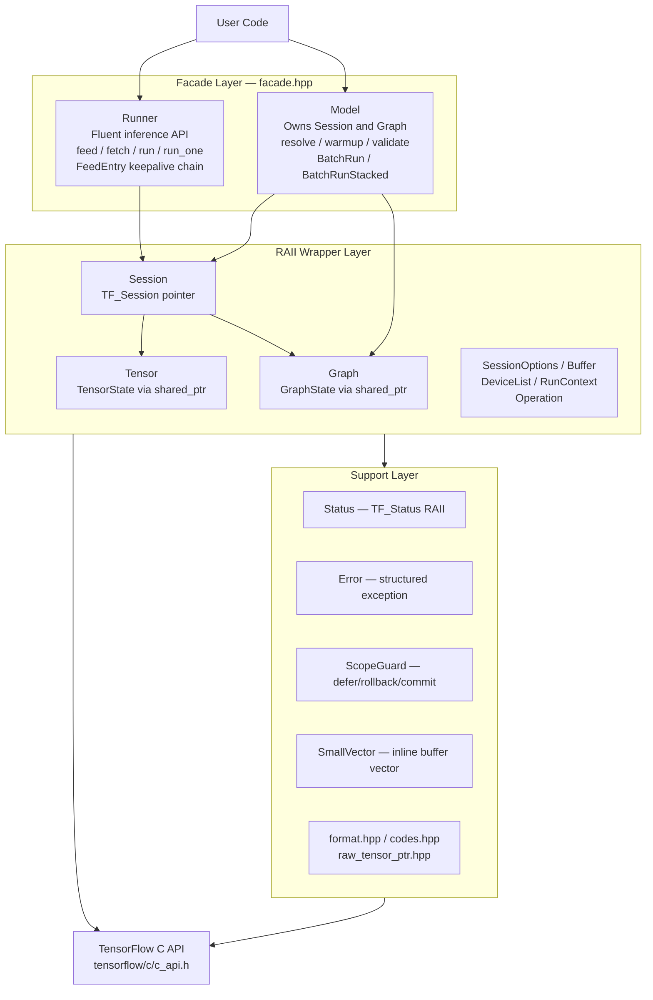

The key design invariant: every TF C API resource is owned by exactly one RAII object in
the wrapper layer. The facade layer holds no raw pointers — it operates exclusively
through the wrapper objects.

---

## 2. Header Map and Dependencies

`core.hpp` is the umbrella header. The diagram below shows the include relationships;
edges point from includer to included. The two fully standalone headers (`scope_guard.hpp`
and `small_vector.hpp`) are highlighted — they have zero TF dependencies and can be
extracted independently.

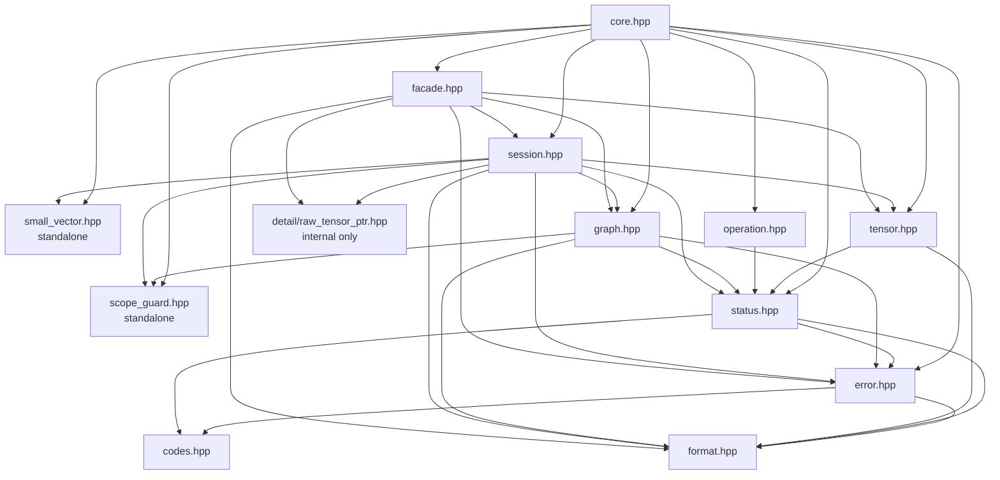

`detail/raw_tensor_ptr.hpp` is a private header providing `unique_ptr<TF_Tensor, TensorDeleter>`.
It exists to give `Session::Run` and `Runner::run` exception-safe ownership of TF output
pointers during the window between `TF_SessionRun` filling `output_vals` and
`Tensor::FromRaw` taking ownership. It should never be included directly.

---

## 3. Ownership and Lifetime Model

This is the central design question in the library. The TF C API hands out raw pointers
that must be deleted in specific ways. The wrapper builds a shared ownership graph on top.

### 3.1 Top-Level Ownership

The `Model` facade owns one `Session` and one `Graph` via `unique_ptr`. Both objects hold
a `shared_ptr` to the same internal `GraphState`, which owns the `TF_Graph*`. This means
the graph is kept alive as long as either the `Session` or the `Graph` object exists —
you can discard the `Graph` and the session's reference alone prevents premature deletion.

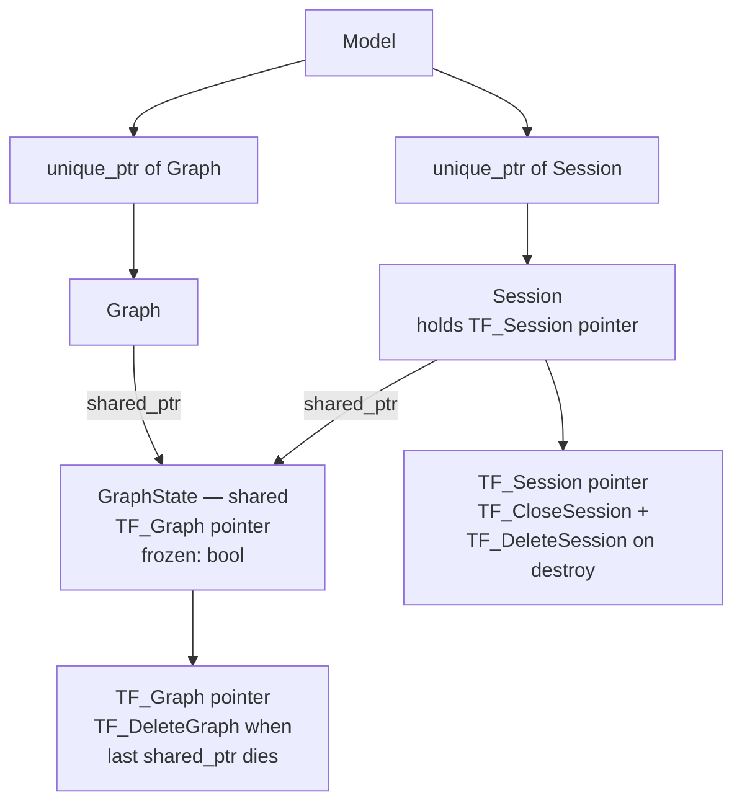

The graph is marked `frozen = true` immediately after loading. This flag documents the
invariant — a graph bound to a live session must not be modified — but is not currently
enforced at the API level.

### 3.2 Tensor Lifetime: TensorState and the shared_ptr Chain

`Tensor` is move-only (copy constructor deleted). `TensorView<T>` is copyable. Both hold
a `shared_ptr<TensorState>`, and `TensorState::~TensorState()` calls `TF_DeleteTensor`.
The raw buffer lives exactly as long as the last reference to its `TensorState`.

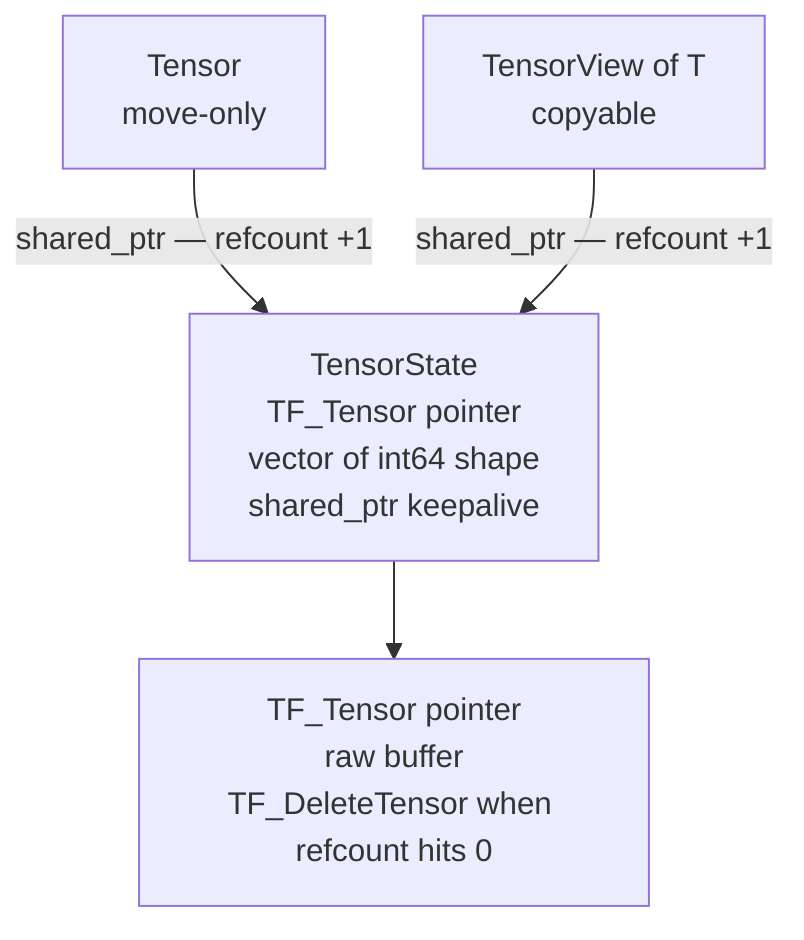

The practical consequence: a `TensorView` obtained from a `Tensor` remains fully valid
after the `Tensor` is moved or destroyed. When the `Tensor` moves, its internal `state_`
is replaced with the moved-from singleton (see §3.3) and the refcount on the original
`TensorState` drops by one — but the view still holds its own reference.

### 3.3 The Moved-From State Singleton

`Tensor`'s move constructor is `noexcept`. The problem: after a move, the moved-from
`Tensor` must not own a live `TF_Tensor*`, but constructing a fresh `TensorState` via
`make_shared` would require heap allocation, which can throw.

The solution is a statically initialized singleton shared by all moved-from instances:

```cpp
static std::shared_ptr<TensorState> moved_from_state() noexcept {
    static auto instance = std::make_shared<TensorState>();
    return instance;
}
```

After the first call, copying the returned `shared_ptr` is effectively `noexcept`. All
moved-from `Tensor` objects share the same empty `TensorState` (tensor = nullptr) at
zero allocation cost.

**Design note:** The very first invocation of `moved_from_state()` could theoretically
throw from `make_shared`. The `noexcept` claim on the move constructor is technically
over-promised, though this never matters in practice.

### 3.4 The reshape() Keepalive Chain

`reshape()` creates a zero-copy view by calling `TF_NewTensor` with a noop deallocator
over the original buffer, then storing the original `TensorState` as the `keepalive`
field in the new one.

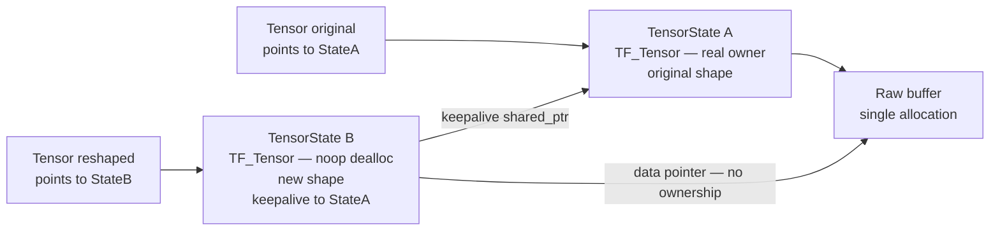

When `Reshaped` is destroyed and its refcount reaches zero, `TensorStateB` destructs,
releasing its keepalive to `TensorStateA`, which may then destruct and call
`TF_DeleteTensor` on the real buffer. The noop deallocator on B's `TF_Tensor*` ensures
TF does not try to free the buffer a second time.

### 3.5 Feed Keepalive in Runner

`Runner` stores `FeedEntry` structs containing a raw `TF_Tensor*` and a
`shared_ptr<const void>` keepalive from `tensor.keepalive()`. This allows passing a
temporary `Tensor` to `feed()` — the raw pointer stays valid through `run()` even though
the `Tensor` object itself has been destroyed.

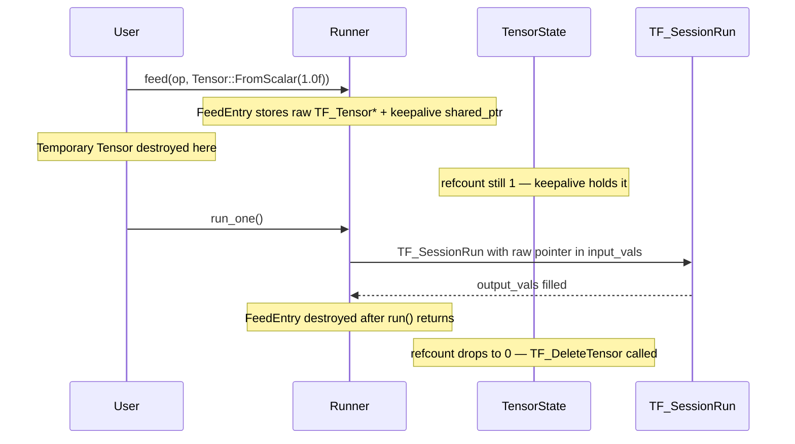

---

## 4. Support Layer: Status, Error, Codes, Format

### 4.1 Status — RAII TF_Status*

`Status` wraps `TF_Status*` with full RAII. The canonical usage is: construct on the
stack, pass `s.get()` to a C API call, then call `throw_if_error`. Because `~Status()`
calls `TF_DeleteStatus`, there is no leak even if the throw propagates through multiple
frames.

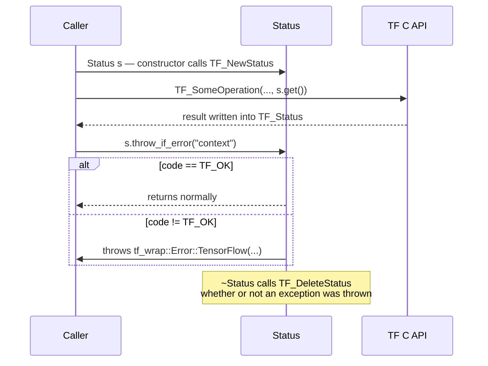

`reset()` calls `TF_SetStatus(st_, TF_OK, "")`, allowing the same `Status` object to be
reused across loop iterations without reallocating. This is used in `Session::BatchRun`
to avoid constructing a new `Status` per input.

### 4.2 Error — Structured Exception

`tf_wrap::Error` derives from `std::runtime_error` and carries full diagnostic context.

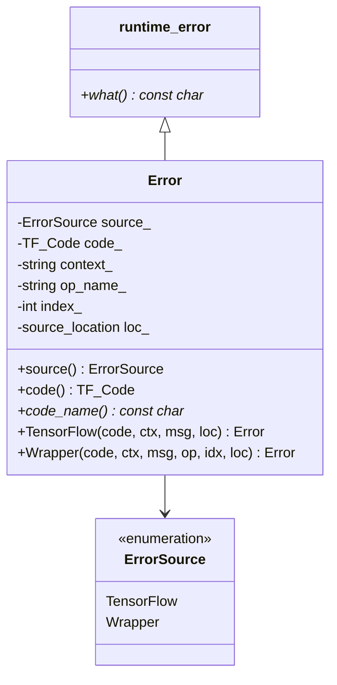

The `what()` string follows this format:

```
[{prefix}_{CODE}] {context} op '{name}:{idx}' at {file}:{line} in {function}: {message}
```

`prefix` is `TF` for errors originating from TensorFlow itself and `WRAP` for errors
raised by the wrapper's own validation. Two static factory methods cover the common
construction paths: `Error::TensorFlow(...)` for errors bubbling up from TF API calls,
and `Error::Wrapper(...)` for argument validation failures raised internally.

### 4.3 codes.hpp and format.hpp

`codes.hpp` provides a single `constexpr` function: `code_to_string(TF_Code) noexcept`,
mapping `TF_OK → "OK"`, `TF_NOT_FOUND → "NOT_FOUND"`, and so on through all 17
`TF_Code` values. It is used in both `Status` and `Error` to produce readable strings.

`format.hpp` is a portability shim. When `__cpp_lib_format >= 201907L`, it delegates to
`std::format`. Otherwise it uses `braces_replace()`: a conservative `{}` substitution
over `ostringstream` that handles `{{`/`}}` escapes but not complex format specifiers.
The library only uses `{}` in error messages, so this is sufficient. This shim is why
all error construction uses `tf_wrap::detail::format(...)` rather than `std::format(...)`
directly — it compiles cleanly on GCC 11 / early libstdc++ builds where `<format>` is
absent.

---

## 5. ScopeGuard

`ScopeGuard` provides deferred execution with three variants and three exception-handling
policies.

### 5.1 Three Variants

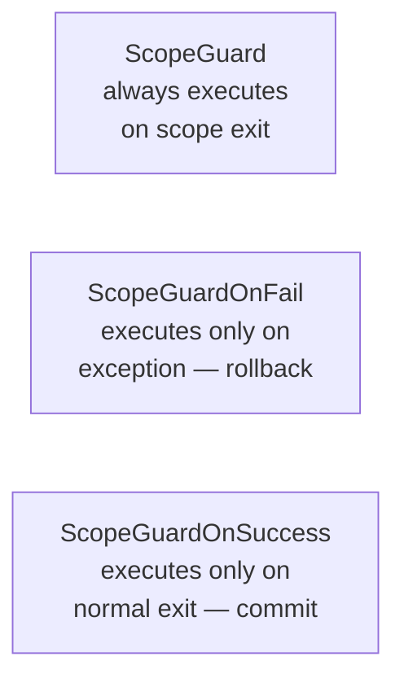

`ScopeGuardOnFail` and `ScopeGuardOnSuccess` use `std::uncaught_exceptions()` (C++17),
capturing the count at construction and comparing at destruction.

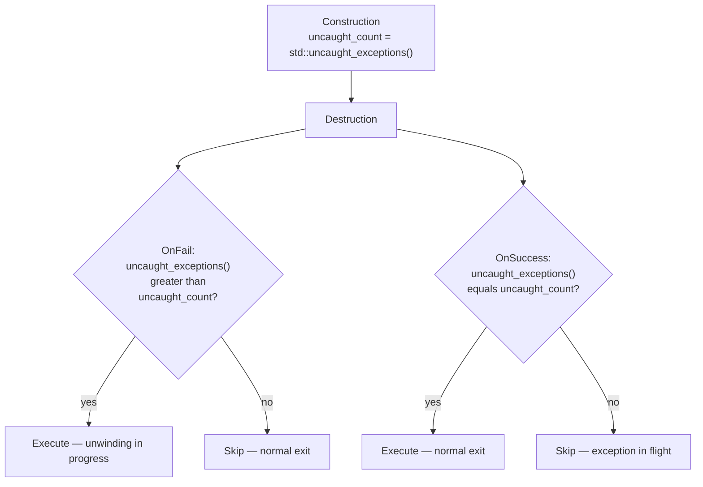

### 5.2 Three Policies (ScopeGuard only)

`ScopeGuardNothrowPolicy` enforces via `static_assert` that the cleanup action is
`noexcept` and executes it directly. `ScopeGuardTerminatePolicy` (the default) wraps
execution in try/catch and calls `std::terminate` if the action throws — correct for TF
cleanup calls like `TF_DeleteTensor` that should never fail. `ScopeGuardSwallowPolicy`
silently suppresses any exception from the cleanup action.

### 5.3 The Macro Trick

`TF_SCOPE_EXIT { cleanup; };` expands to a `ScopeGuardMaker + lambda` pattern:

```cpp
#define TF_SCOPE_EXIT \
    auto TF_SCOPE_GUARD_UNIQUE(tf_scope_exit_) = \
        ::tf_wrap::detail::ScopeGuardMaker{} + [&]() noexcept
```

The `operator+` between `ScopeGuardMaker` and the lambda constructs a `ScopeGuard`
without a factory function call. `__COUNTER__` generates unique variable names so
multiple guards in the same scope compile correctly; it falls back to `__LINE__` when
`__COUNTER__` is unavailable.

**Critical:** `return` inside a `TF_SCOPE_EXIT` block returns from the lambda, not the
enclosing function. `break` and `continue` are invalid inside the block.

---

## 6. SmallVector

`SmallVector<T, N>` stores up to `N` elements in an inline buffer within the object
itself, avoiding heap allocation for the common case.

### 6.1 Memory Layout

The key mechanism: `is_inline()` is a single pointer comparison `data_ == inline_ptr()`.
There is no boolean flag — no branch on every element access.

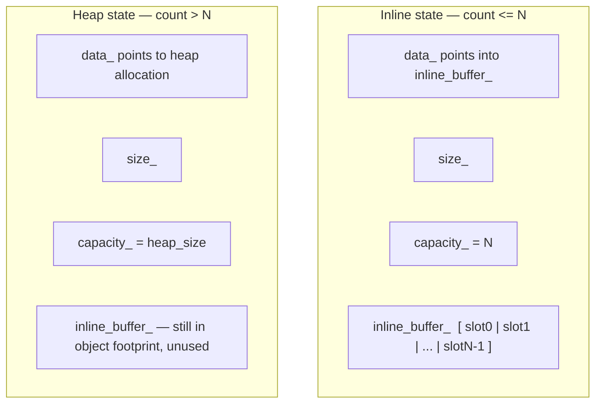

When the inline buffer overflows, `grow(min_capacity)` allocates
`max(min_capacity, capacity * 2)` on the heap. On `shrink_to_fit()`, if
`size_ <= InlineCapacity`, elements are moved back into the inline buffer and the heap
allocation is freed.

### 6.2 Use in Session::Run

`Session::Run` builds the `TF_SessionRun` input arrays using `SmallVector` to avoid heap
allocation for the common case of 8 or fewer feeds and fetches:

```cpp
SmallVector<TF_Output,     8> input_ops;
SmallVector<TF_Tensor*,    8> input_vals;
SmallVector<TF_Output,     8> output_ops;
SmallVector<TF_Operation*, 4> target_ops;
```

The inline capacity for `target_ops` is 4 because targets are rarely used and unlikely
to exceed that count. `SmallVector` is not used for `output_vals` because those pointers
are produced by `TF_SessionRun` and immediately wrapped in `RawTensorPtr` — the count
is always exactly the fetch count.

---

## 7. Tensor

### 7.1 The TensorScalar Concept

Only the following C++ types satisfy the `TensorScalar` concept and may be used as `T`
in `FromVector<T>`, `read<T>()`, `write<T>()`, etc.: `float`, `double`, `int8_t`,
`int16_t`, `int32_t`, `int64_t`, `uint8_t`, `uint16_t`, `uint32_t`, `uint64_t`, `bool`,
`complex<float>`, `complex<double>`. All other types produce a concept failure at compile
time.

`bool` has a special case: `static_assert(sizeof(bool) == 1)` at file scope in
`tensor.hpp` guards against platforms where `bool` is not exactly one byte. `TF_BOOL`
requires 1-byte booleans for correct memory layout. `FromVector<bool>` additionally
uses an element-by-element copy loop rather than `memcpy` as an extra precaution.

### 7.2 dtype Mapping

The mapping is established at compile time via `tf_dtype_of<T>()`. Note that
`dtype_name()` returns lowercase Python-convention names — `"float32"` not `"FLOAT"`,
`"int32"` not `"INT32"`.

| C++ type | TF_DataType | `dtype_name()` |
|---|---|---|
| `float` | `TF_FLOAT` | `"float32"` |
| `double` | `TF_DOUBLE` | `"float64"` |
| `int8_t` | `TF_INT8` | `"int8"` |
| `int16_t` | `TF_INT16` | `"int16"` |
| `int32_t` | `TF_INT32` | `"int32"` |
| `int64_t` | `TF_INT64` | `"int64"` |
| `uint8_t` | `TF_UINT8` | `"uint8"` |
| `uint16_t` | `TF_UINT16` | `"uint16"` |
| `uint32_t` | `TF_UINT32` | `"uint32"` |
| `uint64_t` | `TF_UINT64` | `"uint64"` |
| `bool` | `TF_BOOL` | `"bool"` |
| `complex<float>` | `TF_COMPLEX64` | `"complex64"` |
| `complex<double>` | `TF_COMPLEX128` | `"complex128"` |

`TF_BFLOAT16` and `TF_HALF` are recognised by `dtype_name()` (returning `"bfloat16"`
and `"float16"`) but have no `TensorScalar` C++ type. They can only be created via
`Tensor::Adopt(dtype, ...)` with manual byte handling.

### 7.3 Factory Methods

All factory methods are `static` and return by value. The internal helper
`create_tensor_alloc_()` calls `TF_AllocateTensor`, runs the initializer into the
allocated buffer, and deletes the tensor before rethrowing if the initializer throws.

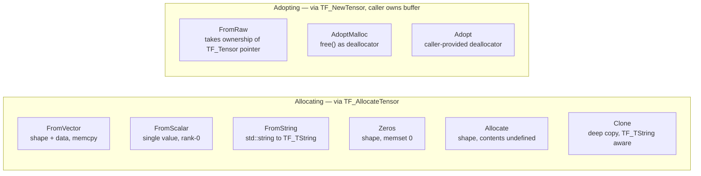

`FromRaw` uses a local `RawTensorGuard` RAII struct that holds the raw pointer and
deletes it on destruction, released only after `TensorState` is fully populated — so if
`shape.push_back` throws on OOM, the raw tensor is correctly deleted.

`create_tensor_adopt_()` uses a parallel `DataGuard` RAII struct: if `TF_NewTensor`
fails, the data buffer is freed via the caller-provided deallocator before the exception
propagates.

### 7.4 Read and Write Views

`read<T>()` and `write<T>()` both validate dtype at runtime before returning a view.

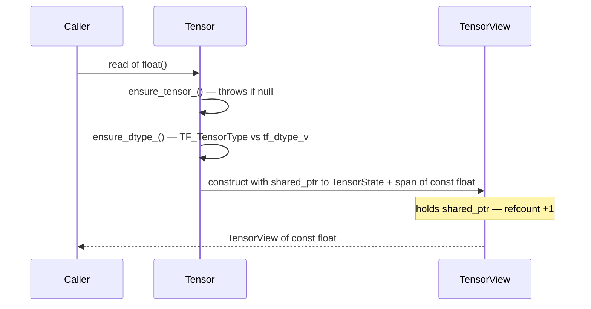

`TensorView<T>` exposes the full iterator interface: `begin/end`, `operator[]`, `at()`,
`size()`, `empty()`, `data()`, `span()`. It does **not** implicitly convert to
`std::span<T>`. Call `.span()` explicitly when you need a raw span — a `std::span` does
not extend the tensor lifetime.

### 7.5 Unsafe Data Access

`data<T>()` and `unsafe_data<T>()` return a raw `T*` pointer into the tensor buffer.
The pointer is only valid while the `Tensor` object exists — unlike a view, there is no
keepalive. These methods exist solely for interfacing with C code that requires a raw
pointer. Prefer `read<T>()` and `write<T>()` everywhere else.

### 7.6 reshape() — Zero-Copy View

`reshape(new_dims)` verifies element count is unchanged, creates a new `TF_Tensor` via
`TF_NewTensor` with a noop deallocator over the original buffer, and stores the original
`TensorState` as the `keepalive` field. Both the original and reshaped tensors share the
same buffer — mutating through one mutates the other. This matches NumPy reshape
semantics (see §3.4 for the ownership diagram).

### 7.7 String Tensors

`FromString(str)` creates a rank-0 `TF_STRING` tensor holding one `TF_TString`.
`ToString()` extracts the string from a rank-0 string tensor. String tensors are not
accessible via the typed template API — `read<char>()` throws a dtype mismatch.
`Clone()` handles string tensors specially using `TF_TString_Copy` element-by-element
rather than `memcpy`, because `TF_TString` has non-trivial internal structure.

---

## 8. Graph

### 8.1 GraphState (Internal)

`Graph` holds `shared_ptr<detail::GraphState>`. `GraphState` owns `TF_Graph*` and is
shared between `Graph` and `Session`. The `TF_Graph*` is deleted only when the last
`shared_ptr<GraphState>` is destroyed. `frozen` is set to `true` by `graph.freeze()`
during `LoadSavedModel` and also by `Session`'s constructor. It is informational — the
API does not currently enforce it, but it documents the invariant that a session-bound
graph must not be modified.

### 8.2 Operation Lookup and Introspection

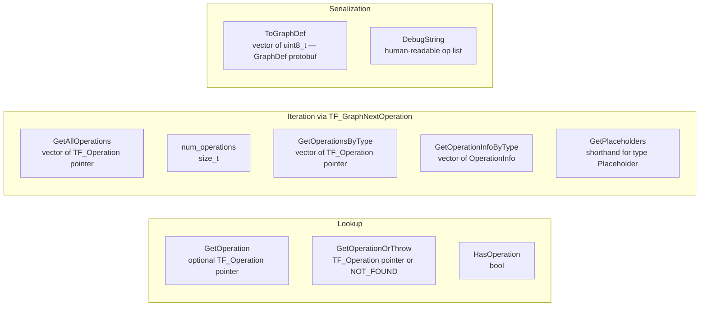

Note the distinction from `Session::resolve`: `Graph::GetOperation` does a plain name
lookup. `Session::resolve` additionally parses the `:index` suffix and validates the
output index against `TF_OperationNumOutputs`. Use the graph introspection methods when
`resolve()` throws `TF_NOT_FOUND` and you need to examine what operations the loaded
model actually exposes.

---

## 9. Session

### 9.1 SessionOptions

RAII wrapper for `TF_SessionOptions*` with a fluent interface. `SetConfig` takes a
serialized `tensorflow::ConfigProto` protobuf, which is the mechanism for configuring GPU
memory growth, inter-op parallelism threads, and XLA JIT. The wrapper does not parse the
protobuf — it passes bytes directly to `TF_SetConfig`. `SessionOptions()` with no
configuration is the default throughout the API.

### 9.2 RunContext — Zero-Allocation Hot Path

`RunContext` holds pre-reserved `std::vector` buffers for feeds, fetches, and targets.
After the first call populates the vectors and allocates their internal storage,
subsequent `reset()` calls only invoke `vector::clear()` — capacity is retained and no
heap traffic occurs in the serving loop.

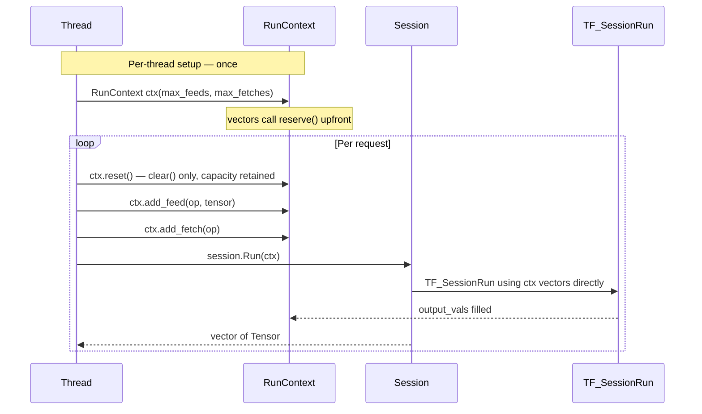

`RunContext` is accessed via `model.session()` — it is not exposed directly through the
`Model` facade.

### 9.3 Session::Run — Internal Data Flow

The span-based `Run` overload is the primary implementation. All other overloads delegate
to it. The `RawTensorPtr` capture-before-throw step is the critical exception-safety
point.

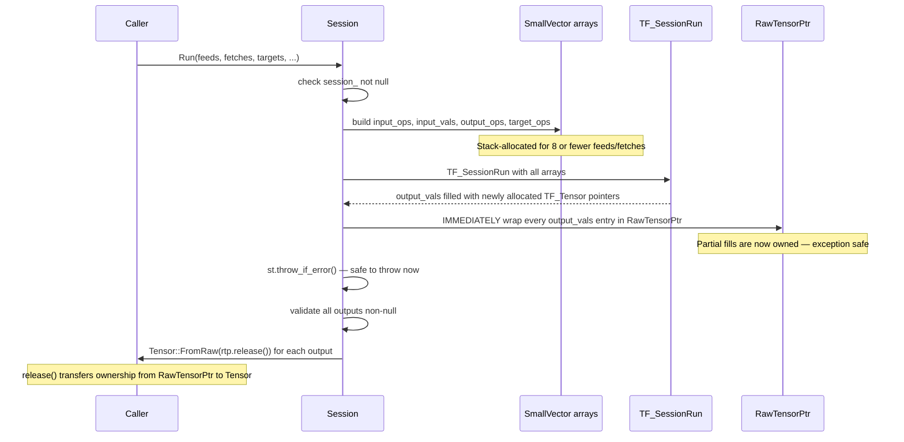

If `TF_SessionRun` fails after partially filling `output_vals`, the `RawTensorPtr`
capture step ensures those non-null pointers are deleted before the exception propagates.
Without this step they would leak.

### 9.4 BatchRun vs BatchRunStacked

```mermaid
flowchart TD
    subgraph BR["BatchRun — one TF call per input"]
        br1["Loop over each input tensor"]
        br2["TF_SessionRun once per tensor"]
        br3["Collect individual results"]
        br1 --> br2 --> br3
    end

    subgraph BS["BatchRunStacked — single TF call"]
        bs1["Validate: all inputs same dtype and shape"]
        bs2["Allocate one batch tensor of shape N x item_shape"]
        bs3["memcpy each input into batch tensor"]
        bs4["One TF_SessionRun for entire batch"]
        bs5["Allocate N individual output tensors"]
        bs6["memcpy split from batched output"]
        bs1 --> bs2 --> bs3 --> bs4 --> bs5 --> bs6
    end
```

`BatchRun` is correct when inputs have different shapes or the model is not
batch-dimension-aware. `BatchRunStacked` makes a single TF call for the whole batch —
more efficient when the model supports a batch dimension, at the cost of `N+1` heap
allocations and the restriction that all inputs must have identical dtype and shape.
Variable-length dtypes (`TF_STRING`) are not supported by `BatchRunStacked` because the
stacking is done via `memcpy`, which requires fixed element sizes.

---

## 10. Facade Layer: Runner and Model

### 10.1 Runner

`Runner` is not thread-safe and must be created per-request or per-thread with `clear()`
between requests.

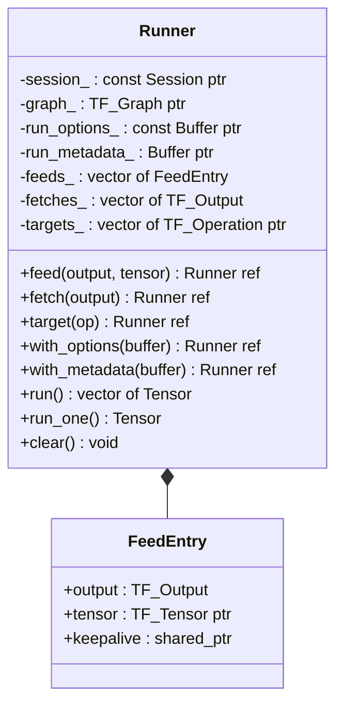

`Runner::run()` reimplements `TF_SessionRun` inline rather than delegating to
`Session::Run`. It reads directly from `feeds_`, `fetches_`, and `targets_` without
building intermediate arrays, and skips the `SmallVector` optimization in favor of plain
`vector` temporaries. The same `RawTensorPtr` capture-before-throw exception safety
protocol from §9.3 applies.

`run_one()` calls `run()` and returns `move(results[0])`. It throws
`Error::Wrapper(TF_INVALID_ARGUMENT, ...)` if `fetches_.size() != 1`.

`clear()` resets all feeds, fetches, and targets and nulls the options and metadata
pointers. It does not release the session pointer — the `Runner` remains usable after
`clear()`.

`with_options` and `with_metadata` both store borrowed pointers — the `Buffer` objects
must outlive the `run()` call. `target(TF_Operation*)` adds an operation that runs but
whose output is not fetched, used for side-effecting operations like variable
initializers.

### 10.2 Model::resolve() — Name Parsing

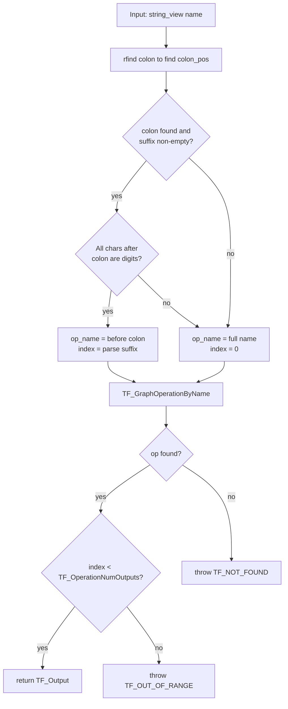

`rfind` is used rather than `find`, so operation names that themselves contain colons
(e.g., `"some:op:0"`) are handled correctly — only the last colon is treated as the
index separator. `resolve()` must be called at startup and the result cached: the string
operations and `TF_GraphOperationByName` hash table lookup are measurable overhead per
call.

### 10.3 Model Production Features

`warmup(input, dummy_tensor, output)` runs one inference call at startup and discards
the result. On the first `TF_SessionRun`, TensorFlow may compile XLA kernels and allocate
device memory — potentially hundreds of milliseconds of latency. `warmup()` absorbs that
cost during initialization so the first real request is not penalized.

`validate_input(input_op, tensor)` checks that `tensor.dtype() == TF_OperationOutputType(input_op)`. It is `noexcept` and returns an empty string on success or an error
description on failure. `require_valid_input` is the throwing variant. Neither validates
shape — TensorFlow reports shape mismatches during `TF_SessionRun` itself.

---

## 11. Operation (Non-Owning Handle)

`Operation` wraps a `TF_Operation*` that the `Graph` owns. It is copyable. Its primary
use is graph introspection — the main inference path uses `TF_Output` handles from
`resolve()` directly.

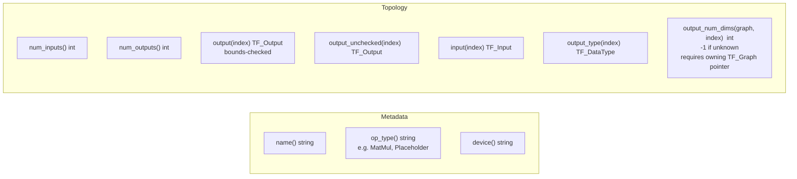

`output_num_dims` requires the owning `TF_Graph*` because TensorFlow stores shape
information on the graph, not on the operation handle itself.

---

## 12. Threading Model

```mermaid
graph TD
    subgraph Safe["Thread-Safe — concurrent access allowed"]
        ts1["Session::Run\nTensorFlow guarantee"]
        ts2["Model — read-only\nresolve and warmup called once at startup\nthen all threads may call session.Run"]
        ts3["Graph — read-only\nfrozen after session creation"]
        ts4["TensorView — read-only\nmultiple concurrent readers safe"]
    end

    subgraph Unsafe["NOT Thread-Safe — create per-thread"]
        tu1["Runner\none per thread, or per request with clear()"]
        tu2["Tensor\ncreate per request — never share mutable tensors"]
        tu3["TensorView — write\nmutation is not thread-safe"]
    end
```

The correct multi-threaded serving structure: one `Model` shared across all threads, one
`Runner` or `RunContext` per thread, one set of input `Tensor` objects per request.

```cpp
// Startup — single-threaded:
auto model     = Model::Load("saved_model");
auto [in, out] = model.resolve("serving_default_input:0",
                               "StatefulPartitionedCall:0");
model.warmup(in, Tensor::Zeros<float>({1, 224, 224, 3}), out);

// Per worker thread — each thread owns its Runner:
void worker() {
    auto runner = model.runner();
    while (true) {
        auto req   = get_next_request();
        auto input = Tensor::FromVector<float>({1,224,224,3}, req.pixels);
        runner.clear();
        auto result = runner.feed(in, input).fetch(out).run_one();
        send(result);
    }
}
```

`in` and `out` are `TF_Output` structs (pairs of pointers) with no mutable state.
Sharing them read-only across threads is safe.

---

## 13. Error Model Reference

### 13.1 Error Hierarchy

```mermaid
classDiagram
    class exception
    class runtime_error {
        +what() const char*
    }
    class Error {
        +source_ ErrorSource
        +code_ TF_Code
        +context_ string
        +op_name_ string
        +index_ int
        +loc_ source_location
    }
    class ErrorSource {
        <<enumeration>>
        TensorFlow
        Wrapper
    }
    exception <|-- runtime_error
    runtime_error <|-- Error
    Error --> ErrorSource
```

### 13.2 TF_Code Values

| Code | String | Typical cause |
|---|---|---|
| `TF_OK` | `"OK"` | Never thrown |
| `TF_CANCELLED` | `"CANCELLED"` | Operation cancelled |
| `TF_UNKNOWN` | `"UNKNOWN"` | Unclassified error |
| `TF_INVALID_ARGUMENT` | `"INVALID_ARGUMENT"` | Bad shape, dtype mismatch, wrong arg count |
| `TF_DEADLINE_EXCEEDED` | `"DEADLINE_EXCEEDED"` | Timeout |
| `TF_NOT_FOUND` | `"NOT_FOUND"` | Operation name not in graph |
| `TF_ALREADY_EXISTS` | `"ALREADY_EXISTS"` | Duplicate resource |
| `TF_PERMISSION_DENIED` | `"PERMISSION_DENIED"` | Access denied |
| `TF_UNAUTHENTICATED` | `"UNAUTHENTICATED"` | Auth required |
| `TF_RESOURCE_EXHAUSTED` | `"RESOURCE_EXHAUSTED"` | OOM, allocation failure |
| `TF_FAILED_PRECONDITION` | `"FAILED_PRECONDITION"` | Null session or graph, moved-from object |
| `TF_ABORTED` | `"ABORTED"` | Operation aborted |
| `TF_OUT_OF_RANGE` | `"OUT_OF_RANGE"` | Output index out of range |
| `TF_UNIMPLEMENTED` | `"UNIMPLEMENTED"` | Feature not implemented |
| `TF_INTERNAL` | `"INTERNAL"` | TF internal error, allocation failure |
| `TF_UNAVAILABLE` | `"UNAVAILABLE"` | Service unavailable |
| `TF_DATA_LOSS` | `"DATA_LOSS"` | Data corruption |

### 13.3 Catching Strategy

```cpp
try { ... }
catch (const tf_wrap::Error& e) {
    if (e.code() == TF_NOT_FOUND) { /* bad operation name */ }
    if (e.source() == tf_wrap::ErrorSource::TensorFlow) { /* TF itself failed */ }
    if (e.source() == tf_wrap::ErrorSource::Wrapper) { /* bad argument to wrapper */ }
    log(e.what());        // full diagnostic string with file:line
    log(e.code_name());   // "NOT_FOUND" etc.
}
```

---

## 14. Production Lifecycle

```mermaid
flowchart TD
    subgraph P1["Phase 1 — Startup, single-threaded"]
        s1["Model::Load\ncalls Session::LoadSavedModel\nTF_LoadSessionFromSavedModel\ngraph.freeze()"]
        s2["model.resolve x2\nparse name:index suffix\nTF_GraphOperationByName\nvalidate output index\ncache TF_Output handles"]
        s3["model.warmup\none TF_SessionRun\ntriggers JIT and device alloc\nresult discarded"]
        s1 --> s2 --> s3
    end

    subgraph P2["Phase 2 — Serving, multi-threaded"]
        s4["Per thread:\nmodel.runner() OR RunContext with reserve()"]
        s5["Per request:\nrunner.clear()\nfeed / fetch / run_one\nor ctx.reset / add_feed / Run(ctx)"]
        s4 --> s5
    end

    subgraph P3["Phase 3 — Shutdown"]
        s6["Model out of scope\nSession: TF_CloseSession + TF_DeleteSession\nGraphState: TF_DeleteGraph when last shared_ptr gone\nAll resources freed in destructor order"]
    end

    P1 --> P2 --> P3
```

**True batching** — single TF call for a batch of requests:

```cpp
std::vector<tf_wrap::Tensor> batch;
for (auto& req : pending_requests)
    batch.push_back(Tensor::FromVector<float>({1,224,224,3}, req.pixels));

auto results = model.BatchRunStacked(in, batch, out);
// N+1 heap allocs: one batch input tensor, N individual output tensors
```

**Input validation before inference:**

```cpp
// Non-throwing check — suitable for hot-path pre-flight:
auto err = model.validate_input(in, tensor);
if (!err.empty()) return {Status::InvalidInput, err};

// Throwing check:
model.require_valid_input(in, tensor);
auto result = model.runner().feed(in, tensor).fetch(out).run_one();
```

---

## 15. dtype Name Reference

`tf_wrap::dtype_name(TF_DataType)` is a free function returning lowercase
Python-convention names. It recognises types beyond the `TensorScalar` set:

| TF_DataType | `dtype_name()` | C++ type | TensorScalar |
|---|---|---|---|
| `TF_FLOAT` | `"float32"` | `float` | yes |
| `TF_DOUBLE` | `"float64"` | `double` | yes |
| `TF_INT8` | `"int8"` | `int8_t` | yes |
| `TF_INT16` | `"int16"` | `int16_t` | yes |
| `TF_INT32` | `"int32"` | `int32_t` | yes |
| `TF_INT64` | `"int64"` | `int64_t` | yes |
| `TF_UINT8` | `"uint8"` | `uint8_t` | yes |
| `TF_UINT16` | `"uint16"` | `uint16_t` | yes |
| `TF_UINT32` | `"uint32"` | `uint32_t` | yes |
| `TF_UINT64` | `"uint64"` | `uint64_t` | yes |
| `TF_BOOL` | `"bool"` | `bool` | yes |
| `TF_COMPLEX64` | `"complex64"` | `complex<float>` | yes |
| `TF_COMPLEX128` | `"complex128"` | `complex<double>` | yes |
| `TF_STRING` | `"string"` | — | no — use FromString / ToString |
| `TF_BFLOAT16` | `"bfloat16"` | — | no — use Adopt |
| `TF_HALF` | `"float16"` | — | no — use Adopt |
| unknown | `"unknown"` | — | — |

---

*User Manual - TensorFlowWrap Coder Reference — March 2026*
